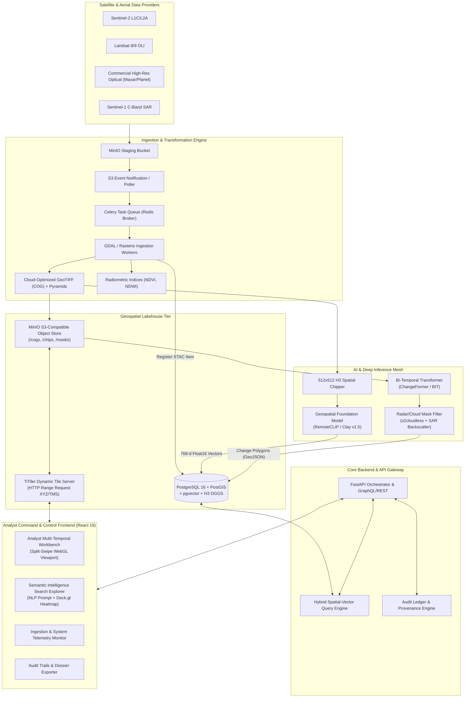

# Project GeoSurge: Autonomous Geospatial Intelligence & Bi-Temporal Surveillance Platform

> **Enterprise / Defense-Grade Earth Observation (EO) Lakehouse, Deep Change Detection, and Multimodal Semantic Retrieval System**

---

## 1. Executive Summary & Mission Overview

**Project GeoSurge** is a distributed, high-performance geospatial intelligence (GEOINT) and Earth Observation (EO) platform. It automates the end-to-end lifecycle of satellite and aerial imagery: from the high-throughput asynchronous ingestion of multi-gigabyte raw sensor data (Sentinel-2, Landsat-8/9, commercial high-resolution SAR and optical constellations) to cloud-optimized transformation, deep multimodal semantic discovery, sub-pixel bi-temporal change detection, false-alarm suppression, and human-in-the-loop analyst validation.

Modern defense, environmental monitoring, and intelligence operations are overwhelmed by petabytes of unstructured raster imagery. Traditional satellite catalogues rely solely on static relational metadata (acquisition timestamp, bounding box, sensor ID, cloud coverage percentage), forcing analysts into manual visual photo-interpretation across millions of square kilometers. GeoSurge bridges this gap through a unified **Geospatial Lakehouse** and **Offline Inference Mesh**, allowing operators to:
1. Query country-scale imagery using natural language prompts (*"deep-water port with container vessels"*, *"surface-to-air missile site in desert terrain"*) or reference visual chips.
2. Automatically flag critical infrastructural, environmental, and tactical changes across time horizons ($T_1 \to T_2$) with deep transformers, filtering out phenological and weather-induced false alarms.
3. Validate and audit geospatial changes through an interactive WebGL dual-viewport workbench with immutable provenance logging.

---

## 2. High-Level System Architecture

The platform is designed around a decoupled, microservices-driven architecture operating on top of a Cloud-Native Geospatial Lakehouse.



---

## 3. Repository Documentation Map & Division of Responsibility

This repository's architecture and product requirements are partitioned into 4 distinct functional pillars across the team.

| Section | Document Path | Title & Scope | Status & Ownership |
| :--- | :--- | :--- | :--- |
| **Architecture** | [`docs/architecture/01-system-overview.md`](file:///c:/Users/AITNS/Documents/26227/docs/architecture/01-system-overview.md) | End-to-End System Architecture, Macro Topologies, Service Boundaries & SLA Budgets | **Authored (Sprint 1)** |
| **Architecture** | [`docs/architecture/02-geospatial-lakehouse.md`](file:///c:/Users/AITNS/Documents/26227/docs/architecture/02-geospatial-lakehouse.md) | Object Storage, COG Structure, STAC Catalogs, PostGIS, pgvector, H3 Hexagonal DGGS | **Authored (Sprint 1)** |
| **Architecture** | `docs/architecture/03-offline-inference-mesh.md` | Model Deployment, Triton Inference Server, GPU Batching, Edge Mesh Deployment | *Partner Assigned* |
| **Architecture** | `docs/architecture/04-security-and-audit.md` | Zero-Trust RBAC, ABAC, Cryptographic Ledger, Data Air-Gapping & Security | *Partner Assigned* |
| **Features** | [`docs/features/FEAT-01-cog-ingestion.md`](file:///c:/Users/AITNS/Documents/26227/docs/features/FEAT-01-cog-ingestion.md) | PRD: Asynchronous Ingestion, COG Pyramid Generation, Radiometric Indexing | **Authored (Sprint 1)** |
| **Features** | [`docs/features/FEAT-02-semantic-retrieval.md`](file:///c:/Users/AITNS/Documents/26227/docs/features/FEAT-02-semantic-retrieval.md) | PRD: RemoteCLIP/Clay Embedding, H3 Chipping, Hybrid SQL+HNSW Vector Search | **Authored (Sprint 1)** |
| **Features** | [`docs/features/FEAT-03-change-detection.md`](file:///c:/Users/AITNS/Documents/26227/docs/features/FEAT-03-change-detection.md) | PRD: Bi-Temporal Transformers, Sub-Pixel Coregistration, Polygonization | **Authored (Sprint 1)** |
| **Features** | `docs/features/FEAT-04-false-alarm-filter.md` | PRD: SAR Backscatter Verification, s2cloudless Cloud/Shadow Masking | *Partner Assigned* |
| **Features** | `docs/features/FEAT-05-similar-site.md` | PRD: Reverse Visual Geo-Intelligence, Target Coordinate Extrapolation | *Partner Assigned* |
| **Features** | `docs/features/FEAT-06-human-in-the-loop.md` | PRD: Analyst Verification, Active Learning Retraining Pipeline | *Partner Assigned* |
| **Dashboards** | [`docs/dashboards/01-analyst-workbench.md`](file:///c:/Users/AITNS/Documents/26227/docs/dashboards/01-analyst-workbench.md) | Spec: Dual-Viewport WebGL Split-Swipe, Vector Overlays, Hotkey Triage UX | **Authored (Sprint 1)** |
| **Dashboards** | [`docs/dashboards/02-intelligence-search.md`](file:///c:/Users/AITNS/Documents/26227/docs/dashboards/02-intelligence-search.md) | Spec: Natural Language Search Console, Bounding Box Tool, Deck.gl Heatmap | **Authored (Sprint 1)** |
| **Dashboards** | `docs/dashboards/03-ingestion-telemetry.md` | Spec: Real-time Ingestion Queue Visualizer, GPU/VRAM Telemetry, Storage Gauges | *Partner Assigned* |
| **Dashboards** | `docs/dashboards/04-audit-and-export.md` | Spec: Verification Ledger, PDF Dossier Export, Multi-Format GeoJSON/KML Exporter | *Partner Assigned* |
| **Frontend** | [`docs/frontend/01-design-system.md`](file:///c:/Users/AITNS/Documents/26227/docs/frontend/01-design-system.md) | Tactical High-Contrast Dark Theme, Map Theming, UI Component Tokens | **Authored (Sprint 1)** |
| **Frontend** | [`docs/frontend/02-state-management.md`](file:///c:/Users/AITNS/Documents/26227/docs/frontend/02-state-management.md) | Zustand State Stores, WebWorker Vector Offloading, Viewport Synchronization | **Authored (Sprint 1)** |
| **Frontend** | `docs/frontend/03-webgl-rendering.md` | MapLibre GL + Deck.gl Integration, Custom Shaders, GPU Memory Management | *Partner Assigned* |

---

## 4. Core Technology Stack Matrix

```
+---------------------------------------------------------------------------------------+
|                                    PRESENTATION TIER                                  |
|   React 19 | TypeScript | Vite | MapLibre GL JS | Deck.gl | Zustand | Tailwind CSS     |
+-------------------------------------------+-------------------------------------------+
                                            | REST / WebSockets / Tile XYZ
+-------------------------------------------v-------------------------------------------+
|                                APPLICATION & RETRIEVAL TIER                           |
|   FastAPI (Python 3.11) | Pydantic v2 | SQLAlchemy 2.0 | TiTiler Dynamic Raster Server|
+-------------------------------------------+-------------------------------------------+
                                            |
         +----------------------------------+----------------------------------+
         |                                                                     |
+--------v-----------------------------------+       +-------------------------v--------+
|       GEOSPATIAL & VECTOR LAKEHOUSE        |       |        DEEP INFERENCE MESH       |
|  PostgreSQL 16                             |       |  PyTorch 2.4 | ONNX Runtime      |
|  - PostGIS 3.4 (Spatial indexing, GiST)   |       |  Celery + Redis Task Queue       |
|  - pgvector 0.7+ (HNSW Cosine Vector Index)|       |  RemoteCLIP / Clay v1.5 (Vision) |
|  - Uber H3-py (Discrete Global Grid)       |       |  ChangeFormer / BIT (Change Det) |
|  MinIO (S3-Compatible Object Store)        |       |  GDAL 3.8+ / Rasterio / Rioxarray|
+--------------------------------------------+       +----------------------------------+
```

---

## 5. Non-Functional Requirements & Performance SLOs

1. **Dynamic Tile Streaming Latency**:
   - $P_{95} \le 85\text{ ms}$ for internal 256x256 Web Mercator tile requests via TiTiler reading COG headers over HTTP range requests.
2. **Semantic Search Response Time**:
   - $P_{95} \le 120\text{ ms}$ for hybrid spatial-filtered cosine nearest-neighbor search across $> 5,000,000$ indexed 768-d vector chips using HNSW indexes (`m=16`, `ef_construction=64`).
3. **Bi-Temporal Inference Throughput**:
   - $\le 15\text{ seconds}$ to ingest, coregister, infer, and polygonize change events over a standard $100\text{ km}^2$ Area of Interest (AOI) at 10m Ground Sample Distance (GSD).
4. **Sub-Pixel Coregistration Precision**:
   - Registration error $\le 0.25\text{ pixels}$ cross-correlation offset between $T_1$ and $T_2$ prior to feeding feature difference heads.
5. **Client Viewport Fluidity**:
   - Stable $60\text{ FPS}$ during split-swipe dual viewport panning and dragging with $> 10,000$ vector polygon nodes active on the canvas.

---

## 6. Local Quickstart & Development Sequence

### 6.1 Prerequisites
- Docker Engine $\ge 24.0$ & Docker Compose v2
- NVIDIA Container Toolkit (for GPU inference workers)
- Python 3.11+ & Poetry / uv
- Node.js 20+ LTS & pnpm

### 6.2 Spin Up Infrastructure
```bash
# 1. Clone repository
git clone https://github.com/Arsh-03/26227.git
cd 26227

# 2. Launch Local Lakehouse Services (PostgreSQL + PostGIS + pgvector, MinIO, Redis)
docker compose up -d postgres minio redis titiler

# 3. Apply Lakehouse Migrations & Extensions
docker compose exec postgres psql -U geosurge -d geosurge_db -c "CREATE EXTENSION IF NOT EXISTS postgis; CREATE EXTENSION IF NOT EXISTS vector;"
```
