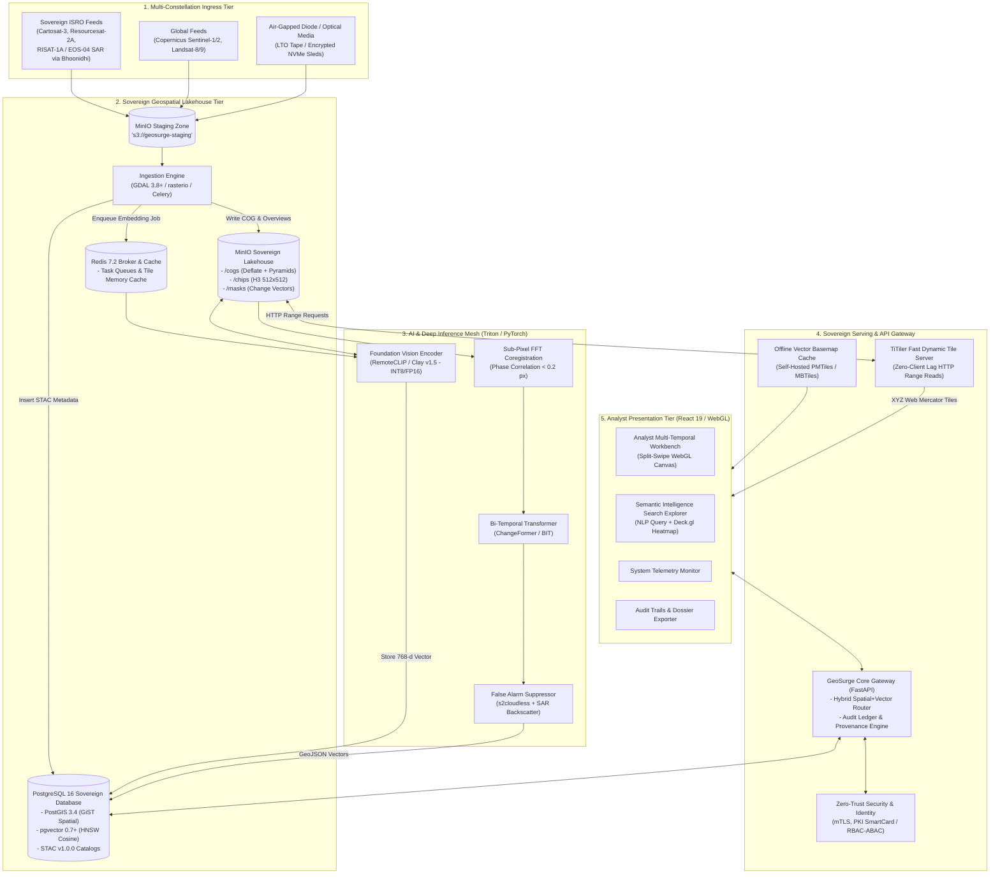
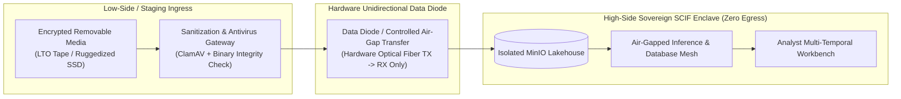
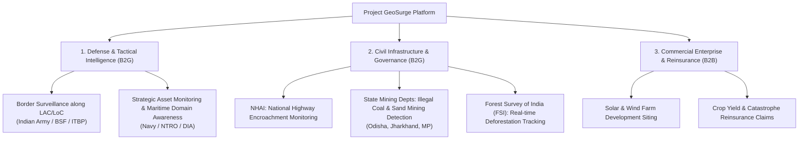

# System Architecture Specification: Project GeoSurge

**Document ID:** `ARCH-01-SYSTEM-OVERVIEW`  
**Classification:** Sovereign Defense & Enterprise Architecture Specification  
**Version:** 2.0.0 (Enhanced Sovereign & Dual-Feasibility Edition)  
**Status:** Approved  
**Target Audience:** Lead Architects, Systems Engineers, Defense/SecOps, Machine Learning Engineers, Product Managers  
**Regulatory Compliance:** National Geospatial Policy 2022 (NGP 2022), MeitY Cloud Security Guidelines, In-SPACe / Remote Sensing Data Policy (RSDP), CERT-In Cyber Security Directions  

---

## 1. Architectural Manifesto & Sovereign Defense Mandate

Project GeoSurge is an autonomous, high-throughput geospatial intelligence (GEOINT) and Earth Observation (EO) surveillance platform. Moving beyond generic commercial cloud architectures, GeoSurge is engineered specifically for **sovereign defense, tactical border monitoring, critical national infrastructure surveillance, and disaster response**.

### 1.1 Core Architectural Principles
1. **100% Sovereign Data Containment & Air-Gap Operability:** The system has **zero external runtime SaaS dependencies**. No public cloud APIs, third-party tokenizers, or external mapping CDN calls are permitted. The entire stack—from raster tiling and foundation model inference to vector search—is fully containerized and deployable in completely isolated, air-gapped SCIFs (Sensitive Compartmented Information Facilities) or tactical edge shelters.
2. **Indian Regulatory Compliance (NGP 2022 & In-SPACe):** Strictly enforces India's **National Geospatial Policy 2022** and **Remote Sensing Data Policy (RSDP)**. Sub-meter optical data (e.g., Cartosat-2/3) and strategic defense boundary layers are subject to domestic residency, local processing, and attribute-based access control (ABAC) masking.
3. **Format-First Optimization (Storage as Compute Enabler):** Raw multi-band imagery is transformed into **Cloud-Optimized GeoTIFFs (COGs)** with internal $512 \times 512$ pixel tiles and multi-scale overviews. Using HTTP Range Requests (RFC 7233), spatial tile engines access exact bounding box bytes without streaming multi-gigabyte flat rasters.
4. **Multi-Constellation Sensor Fusion (Optical + SAR):** Integrates open international feeds (Sentinel-2, Landsat-8/9) with sovereign Indian space assets (**ISRO Cartosat-2/3, Resourcesat-2A LISS-4/AWiFS, and RISAT-1A / EOS-04 C-band SAR**).
5. **Discrete Global Grid Indexing (H3 DGGS):** Planetary coordinates are anchored to Uber's H3 hexagonal grid (Resolutions 8 & 9), guaranteeing uniform spatial indexing, $O(1)$ neighbor traversals, and eliminating polar/meridian coordinate distortions.
6. **Unified Hybrid Lakehouse:** Unifies relational metadata, spatiotemporal STAC catalogs, PostGIS geometries, and 768-dimensional AI vector embeddings inside a single hardened PostgreSQL 16 engine with `pgvector` HNSW indexes.
7. **Dual-Feasibility Design:** The architecture is strictly decoupled to run in two distinct operational envelopes:
   - **Profile A (Sovereign Production Cluster):** Multi-node, GPU-accelerated Kubernetes mesh capable of processing country-scale feeds.
   - **Profile B (Constrained MVP / Tactical Edge Node):** Single workstation or laptop (8–16 GB RAM, consumer RTX GPU or CPU-only with INT8 quantization) capable of full functional demonstration.

---

## 2. Macro System Topology & Dual-Deployment Modes



### 2.1 Deployment Profile Comparison

| Architectural Dimension | Profile A: Sovereign Enterprise Cluster | Profile B: Constrained MVP / Tactical Node |
| :--- | :--- | :--- |
| **Target Deployment** | MeitY-Empaneled GovCloud / National Data Center / MoD HQ | Single Ruggedized Laptop / Workstation (Dev / Field Unit) |
| **Compute Hardware** | 4–8 Nodes, 4× NVIDIA A100 / L40S (48GB VRAM) | 1× Machine (Intel i7/Ryzen 7, 16GB RAM, RTX 3060/4060 or CPU) |
| **Storage Infrastructure** | Distributed MinIO / Ceph (100 TB – 2 PB NVMe/SSD) | Local Single-Disk MinIO Container ($250\text{ GB} - 1\text{ TB}$) |
| **Model Quantization** | Full Precision Float16 / TensorRT Engine | INT8 Quantized ONNX Runtime / OpenVINO |
| **Sensor Ingress** | Automated S3 Bucket Mirroring / Bhoonidhi API Pollers | Manual Folder Drop / Sample COG Bundles |
| **Basemap Provider** | Self-hosted Enterprise PMTiles Planet Server | Localized PMTiles Regional Extract ($150\text{ MB} - 1\text{ GB}$) |
| **Network Security** | Air-Gapped High-Side LAN or mTLS VPN | Standalone Localhost Network Boundary (`127.0.0.1`) |

---

## 3. Indian Ground Reality & Regulatory Integration

```
+-----------------------------------------------------------------------------------------+
| INDIAN REGULATORY & DATA SOVEREIGNTY MATRIX                                             |
+------------------------------+----------------------------------+-----------------------+
| Regulatory Directive         | Compliance Mandate               | GeoSurge Enforcement  |
+------------------------------+----------------------------------+-----------------------+
| National Geospatial Policy   | High-resolution data (<1m GSD)   | On-premise storage;   |
| (NGP 2022)                   | must be processed domestically   | Zero egress outside   |
|                              | on Indian servers.               | sovereign boundary.   |
+------------------------------+----------------------------------+-----------------------+
| Remote Sensing Data Policy   | Sensitive strategic areas        | Dynamic geometric     |
| (RSDP / In-SPACe)            | subject to security masking.     | polygon redaction     |
|                              |                                  | based on user clearance|
+------------------------------+----------------------------------+-----------------------+
| MeitY Cloud Empanelment      | Government/Defense workloads     | Docker/K8s manifests  |
| Guidelines                   | must run on empaneled clouds     | deployable on Yotta,  |
|                              | (Yotta, NIC, ESDS, AWS India).   | NIC, or bare metal.   |
+------------------------------+----------------------------------+-----------------------+
| CERT-In Security Directives  | Immutable audit logs; 6-hour     | Cryptographic SHA-256 |
| (April 2022 Mandate)         | incident reporting; NTP time sync| provenance ledger with|
|                              | via Indian Standard Time (IST).  | NPL Stratum-1 clock.  |
+------------------------------+----------------------------------+-----------------------+
```

### 3.1 ISRO & Domestic Constellation Ingestion Adapters
GeoSurge natively incorporates ingestion drivers for Indian remote sensing instruments:
1. **Cartosat-2/3 Series (Panchromatic & Multispectral):** Sub-meter Ground Sample Distance ($0.25\text{m} - 0.8\text{m}$) for tactical site verification and target entity recognition.
2. **Resourcesat-2A (LISS-4 & AWiFS):** $5.8\text{m}$ multispectral swath optimized for regional land-use, forestry encroachment, and cross-district change detection.
3. **RISAT-1A / EOS-04 (C-Band Synthetic Aperture Radar):** Penetrates dense cloud cover and monsoon precipitation across Himalayan border regions (LAC/LoC), delivering all-weather day/night ground roughness verification.
4. **NRSC Bhoonidhi Open Ingestion:** Automated metadata and tile harvest pipelines consuming standard OGC (WMS/WMTS/WCS) services published by the National Remote Sensing Centre (Hyderabad).

---

## 4. Air-Gapped Security Architecture & Zero-Trust Protocols

For defense and classified operations, GeoSurge implements an impenetrable **Air-Gapped Security Perimeter**:



### 4.1 Key Security Protocols
1. **Unidirectional Hardware Data Diodes:** Data flows exclusively from low-side ingress to high-side operational lakehouses via physical fiber-optic hardware diodes, physically preventing data exfiltration.
2. **Mutual TLS (mTLS) Everywhere:** Internal microservice communication enforces TLS 1.3 with local PKI-issued X.509 certificates and ephemeral ECDHE key exchanges.
3. **Hardware Security Module (HSM) Provenance Signing:** Change detection verification dossiers and analyst sign-offs are hashed (SHA-256) and signed using FIPS 140-3 Level 3 HSM keys, guaranteeing non-repudiation in judicial or military courts of inquiry.
4. **Offline Basemap Provisioning:** Standard web maps fail in air-gapped SCIFs due to dead external map tile requests. GeoSurge packages offline country-scale **PMTiles** (derived from Survey of India open data and OpenStreetMap), served locally by TiTiler.

---

## 5. Dual Feasibility Analysis: Prototype (MVP) vs. Production Scale

### 5.1 Profile B: Feasibility of Building an MVP with Limited Resources
A fully operational, high-impact demonstration of GeoSurge can be built and run on **a single standard developer laptop or mid-range desktop**:

```
+----------------------------------------------------------------------------------------+
| MVP RESOURCE ENVELOPE (Runs on 1x Machine: 16GB RAM, RTX 3060/4060 or CPU)            |
+----------------------------+-----------------------------+-----------------------------+
| Component                  | Prototype / MVP Spec        | Optimization Mechanism      |
+----------------------------+-----------------------------+-----------------------------+
| Vector Lakehouse           | PostgreSQL 16 + pgvector    | Single Docker container     |
| Object Storage             | MinIO Standalone (S3)       | Single disk mount (50 GB)   |
| Dynamic Tile Server        | TiTiler (FastAPI / Uvicorn) | 2 CPU worker threads        |
| Foundation Vision Encoder  | RemoteCLIP (ViT-B/32)       | INT8 Quantization (ONNX)    |
| Bi-Temporal Change Model   | TinyCD / Pruned ChangeFormer| INT8 Quantization (VRAM <2GB)|
| Vector Basemap             | Local PMTiles (Regional)    | Single 450MB file on disk   |
| Front-End Workbench        | React 19 + MapLibre GL      | Static Vite development build|
+----------------------------+-----------------------------+-----------------------------+
| TOTAL RESOURCE CONSUMPTION | RAM: ~7.2 GB | VRAM: ~2.8 GB (or 4.5 GB RAM on pure CPU)  |
+----------------------------------------------------------------------------------------+
```

#### How to Demonstrate the MVP with Limited Hardware:
1. **Curate a Compact 3-Scene Demonstration Corpus:** Pre-load 3 temporal passes over a key operational area (e.g., Mumbai Port or Delhi-NCR) covering:
   - Date $T_0$: Baseline terrain.
   - Date $T_1$: Ongoing construction / excavation.
   - Date $T_2$: Completed infrastructure (new runway, dock, or solar park).
2. **Execute Ingestion & Pyramidal Tiling:** Demonstrate live ingestion of a 500MB GeoTIFF converted to COG in $< 12\text{ seconds}$ on local disk.
3. **Execute Natural Language Search:** Input queries like *"naval docks with berthed vessels"* or *"circular industrial tanks"*; demonstrate sub-80ms vector retrieval using pgvector HNSW on local CPU/GPU.
4. **Showcase Split-Swipe Dual Viewport:** Slide across the WebGL divider in 60 FPS, toggle real-time confidence sliders, and press `A` to accept change polygons into the local audit table.

### 5.2 Profile A: Path to Full-Scale Production Deployment
When capital and dedicated infrastructure are provisioned, the exact same software interfaces scale horizontally without code rewriting:
- **Compute Cluster:** 8× Kubernetes worker nodes with NVIDIA Triton Inference Server orchestrating TensorRT-LLM and CUDA kernels across A100/H100 pools.
- **Storage Tier:** Distributed 8-node MinIO or Ceph cluster delivering $> 25\text{ GB/sec}$ aggregate read throughput over 100 Gbps RoCE (RDMA over Converged Ethernet).
- **Lakehouse Capacity:** Partitioned PostgreSQL 16 handling $> 50,000,000$ indexed H3 vector chips across the entire Indian landmass ($3.287\text{ million km}^2$).

---

## 6. Unit Economics, Cost Modeling & Revenue Generation

### 6.1 Cost Breakdown (OpEx vs. CapEx)

```
+-----------------------------------------------------------------------------------------+
| COST ARCHITECTURE: PROCESSING & INDEXING 100,000 km² / MONTH                            |
+--------------------------------+-----------------------------+--------------------------+
| Cost Center                    | Cloud Deployment (MeitY)    | On-Premises Air-Gap (MoD)|
+--------------------------------+-----------------------------+--------------------------+
| Storage (600 GB COGs/month)    | $12 - $18 / month           | CapEx amortized ($3/TB)  |
| Compute / Inference (Triton)   | 1x Spot L40S ($0.85/hr)     | 2x Workstations ($8,000) |
| Database / Lakehouse           | 1x 8-vCPU 32GB RAM ($95/mo) | Included in on-prem base |
| Dynamic Tile Egress            | $0 (Internal VPC / On-Prem) | $0                       |
+--------------------------------+-----------------------------+--------------------------+
| TOTAL RUNNING COST             | ~$280 - $350 / month        | Near-Zero marginal OpEx  |
+--------------------------------+-----------------------------+--------------------------+
```

### 6.2 Revenue & Monetization Channels



1. **Defense & Homeland Security Contracts (High-Value Sovereign Licensing):**
   - Annual Enterprise Sovereign License per Command HQ ($\text{₹ } 2.5 - 6.0\text{ Crore / year}$).
   - Includes on-prem deployment, custom tactical target model fine-tuning, and ruggedized edge device integration.
2. **Civil Governance & Public Sector Undertakings (PSUs):**
   - **NHAI & Indian Railways (PM Gati Shakti):** Continuous linear corridor monitoring billed per linear km monitored ($\text{₹ } 1,200 - 2,500\text{ / km / year}$).
   - **State Mining & Forestry Departments:** Automated change-alert subscription charging per district ($10,000\text{ km}^2$ monitoring package at $\text{₹ } 45 - 80\text{ Lakhs / state / year}$).
3. **Commercial Satellite Imagery Analytics (SaaS API):**
   - Tiered API pricing for developers and renewable energy firms searching regional sites at $\$0.02\text{ per search query}$ and $\$0.15\text{ per km}^2$ change analysis sweep.

---

## 7. System Latency, Throughput & Production SLO Budgets

```
+---------------------------------------------------------------------------------------+
| SYSTEM SERVICE LEVEL OBJECTIVES (SLOs) ACROSS PROFILES                                |
+------------------------------------+------------------------+-------------------------+
| Metric Description                 | Profile B (MVP Laptop) | Profile A (Prod Cluster)|
+------------------------------------+------------------------+-------------------------+
| TiTiler 256x256 Raster Tile Stream | P95 <= 95 ms           | P95 <= 45 ms            |
| Semantic Search (Top-50 Chips)     | P95 <= 140 ms          | P95 <= 65 ms            |
| Vector Index Scan (HNSW)           | P95 <= 35 ms           | P95 <= 12 ms            |
| 1GB Scene Ingestion to COG         | <= 25 seconds          | <= 9 seconds            |
| Change Detection over 100 km²      | <= 28 seconds (INT8)   | <= 6 seconds (TensorRT) |
| WebGL Canvas Frame Rate            | 60 FPS                 | 60 FPS                  |
| Air-Gap Sneakernet Ingress Sync    | Manual batch load      | Auto-diode queue sync   |
+------------------------------------+------------------------+-------------------------+
```
