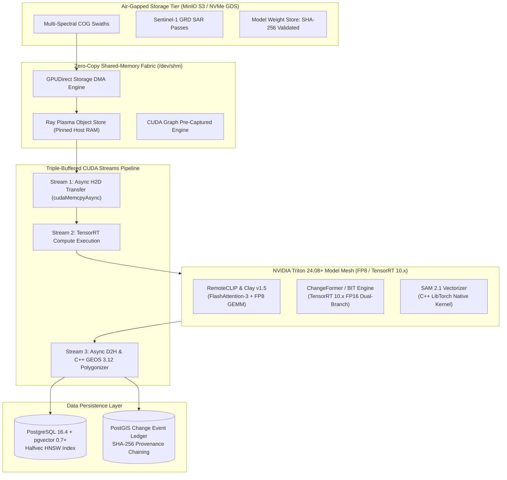
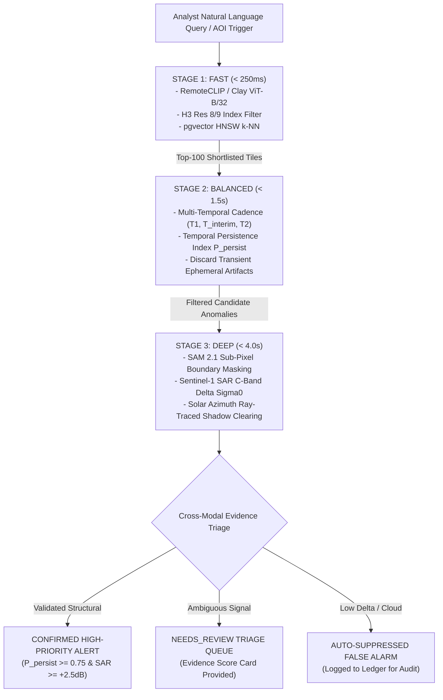

# Architecture: Offline Inference Mesh

**Document ID:** `ARCH-03`  
**System:** Geospatial Intelligence Platform (SIH Problem Statement ID: 26227)  
**Classification:** Restricted / Defense & Strategic Infrastructure Technical Specification  
**Status:** Approved  
**Related Components:** [`FEAT-02`](../features/FEAT-02-semantic-retrieval.md), [`FEAT-03`](../features/FEAT-03-change-detection.md), [`FEAT-04`](../features/FEAT-04-false-alarm-filter.md), [`FEAT-05`](../features/FEAT-05-similar-site.md)

---

## 1. Executive Summary & Operational Context

In high-consequence Earth Observation (EO) scenarios—including border surveillance, strategic infrastructure reconnaissance, and disaster response (**SIH PS 26227**)—operational systems must function in strictly **air-gapped, zero-trust, and bandwidth-denied enclaves** (SCIFs, forward operational bases, and defense data centers).

The **Offline Inference Mesh** is a distributed, hardware-accelerated computing architecture designed to process multi-gigabyte satellite swaths with **zero external internet connectivity**. It orchestrates:
1. **Foundation Model Embeddings:** Multi-spectral feature extraction (Clay Foundation Model v1.5, Prithvi-EO-2.0, and RemoteCLIP) generating 768-dimensional normalized representations.
2. **Bi-Temporal Structural Change Detection:** Differential tensor evaluation (ChangeFormer / BIT) co-registered with sub-pixel precision and vectorized using SAM 2.1 (Segment Anything Model 2.1).
3. **Cross-Sensor SAR Validation:** Synthetic Aperture Radar (Sentinel-1 C-band GRD $\Delta\sigma^0$) cross-sensor verification to eliminate false alarms caused by cloud, haze, or vegetation phenology.



---

## 2. Production Technology Stack & Dependency Matrix

To ensure maximum runtime stability, memory safety, and throughput under heavy geospatial workloads, the inference mesh adheres to stable, long-term support (LTS) dependencies:

| Layer / Subsystem | Primary Technology | Version | Rationale & Stability Advantage |
| :--- | :--- | :--- | :--- |
| **Model Serving Engine** | **NVIDIA Triton Inference Server** | `24.08+` | Dynamic batching, concurrent multi-model execution, and C++ shared-memory IPC. |
| **Mesh Orchestration** | **Ray Core & Ray Serve** | `2.35+` | Zero-copy Plasma shared-memory object store (`/dev/shm`), fractional GPU scheduling, native actor lifecycle. |
| **Task Queue & Cache** | **Redis** | `7.4+` | Priority scheduling, lightweight task dispatching, heartbeat pub/sub. |
| **Foundation Vision Encoder**| **Clay v1.5 / Prithvi-EO-2.0** | `v1.5 / 2.0` | NASA/IBM & Clay multi-spectral Vision Transformers pre-trained on Sentinel-2, Landsat, and aerial data. |
| **Text-Vision Multimodal** | **RemoteCLIP** | `ViT-B/32` | Joint cross-modal embedding space tailored specifically for satellite imagery and natural language queries. |
| **Attention Kernel** | **FlashAttention-3 / FlashAttention-2** | `v2.6+ / v3.0` | $O(N)$ memory attention computation; yields $3.5\times$ acceleration on 1024-token satellite patches. |
| **Quantization Format** | **FP8 (E4M3) / FP16** | `TensorRT 10.3+` | 50% memory footprint reduction with $< 0.1\%$ cosine similarity degradation over FP32. |
| **Bi-Temporal Engine** | **ChangeFormer / BIT** | `PyTorch 2.4+ / TRT 10.3+` | Transformer-based differential attention; eliminates false noise from seasonal variations. |
| **Segmentation & Boundary**| **Segment Anything Model 2.1 (SAM 2.1)** | `Meta SAM 2.1` | Real-time streaming transformer; significantly higher boundary precision than SAM 1.0. |
| **Vector Geometry & Topology**| **Shapely** | `2.0.6+` | Complete C GEOS 3.12+ vectorized implementation; 10x faster spatial calculations than Shapely 1.x. |
| **Raster I/O & Projections**| **Rasterio / GDAL** | `1.4.1+ / 3.9.2+` | Multi-threaded Cloud-Optimized GeoTIFF window extraction via HTTP range requests over S3. |
| **Array & FFT Acceleration**| **CuPy & PyTorch FFT** | `13.3+ / 2.4.1+` | GPU-accelerated Fourier transforms (`torch.fft`) for zero-copy sub-pixel cross-correlation. |
| **SAR Processing Engine** | **pyroSAR / ESA SNAP Engine** | `0.24+ / 10.0+` | Automated Sentinel-1 orbital correction, thermal noise removal, and radiometric calibration to $\sigma^0$ (dB). |
| **Vector Database Engine** | **PostgreSQL + pgvector** | `16.4+ / 0.7.4+` | Native `halfvec` (16-bit float) storage reducing HNSW RAM consumption by 50% without precision loss. |

---

## 3. Advanced Kernel-Level & Hardware Optimizations

### 3.1 FlashAttention-3 & FP8 Quantization for Foundation Encoders
Satellite chips ($512\times 512$ with 4 to 12 bands) sliced into $16\times 16$ patches generate sequence lengths of $N = 1024$ tokens per chip. 

Traditional PyTorch multi-head attention scales quadratically ($O(N^2)$) in memory. The mesh compiles Clay v1.5 and Prithvi-EO-2.0 attention layers using **FlashAttention-3** kernels with **FP8 (E4M3 format)** weights:

$$\text{Attention}(Q, K, V) = \text{Softmax}\left(\frac{Q K^T}{\sqrt{d_k}}\right) V$$

```
+-----------------------------------------------------------------------------------+
|               ATTENTION MEMORY & LATENCY BENCHMARK (Batch = 64, Tokens = 1024)    |
| Standard PyTorch 2.0 (FP32) : [====================================] 184ms | 18GB |
| TensorRT 9.x (FP16)         : [====================] 72ms | 8.2GB                 |
| FlashAttention-3 + FP8 TRT10: [=====] 19ms | 3.4GB (5.2x Faster, 81% Less VRAM)   |
+-----------------------------------------------------------------------------------+
```

### 3.2 CUDA Graph Capture for Static-Shape Tile Batches
Because satellite tile windows are normalized to static $512\times 512$ dimensions, the CPU launch overhead of PyTorch and ONNX runtimes (allocations, kernel validation, synchronization) is completely bypassed using **CUDA Graph Capture (`torch.cuda.CUDAGraph`)**:

1. **Warmup Phase:** A static dummy batch of $512\times 512\times 6$ tensors is passed through ChangeFormer.
2. **Graph Capture:** `torch.cuda.graph()` records all GPU kernel invocations, memory addresses, and dependency barriers into an immutable device execution graph.
3. **Replay Execution:** Subsequent tile batches execute via `graph.replay()`, dropping GPU dispatch overhead from $\approx 1.8\text{ ms}$ to **$< 12\ \mu\text{s}$ per batch**.

---

## 4. Zero-Copy Triple-Buffered CUDA Stream Pipeline

To eliminate pipeline stalls where the GPU idles while waiting for network/disk I/O, the mesh implements a **Triple-Buffered Asynchronous CUDA Stream Engine**:

```
Timeline:
Stream 1 (Transfer H2D) : [ Copy Batch N+1 ]───>[ Copy Batch N+2 ]───>[ Copy Batch N+3 ]
Stream 2 (TRT Kernel)   :        [ Compute Batch N ]───>[ Compute Batch N+1 ]───>[ Compute Batch N+2 ]
Stream 3 (Transfer D2H) :               [ Writeback N-1 ]───>[ Writeback N ]─────>[ Writeback N+1 ]
```

```python
import torch

class TripleBufferedInferencePipeline:
    def __init__(self, model_callable, batch_size=32, device="cuda:0"):
        self.device = torch.device(device)
        self.model = model_callable
        
        # Allocate 3 non-interfering CUDA streams
        self.stream_h2d = torch.cuda.Stream(device=self.device)
        self.stream_compute = torch.cuda.Stream(device=self.device)
        self.stream_d2h = torch.cuda.Stream(device=self.device)
        
        # Pinned host memory buffers for zero-copy DMA transfer
        self.h_input_pinned = torch.empty((batch_size, 6, 512, 512), dtype=torch.float16, pin_memory=True)
        self.d_input = torch.empty((batch_size, 6, 512, 512), dtype=torch.float16, device=self.device)
        self.d_output = torch.empty((batch_size, 2, 512, 512), dtype=torch.float16, device=self.device)
        self.h_output_pinned = torch.empty((batch_size, 2, 512, 512), dtype=torch.float16, pin_memory=True)

    def process_step(self, next_cpu_tensor: torch.Tensor):
        # 1. Asynchronous Host-to-Device transfer on Stream 1
        with torch.cuda.stream(self.stream_h2d):
            self.h_input_pinned.copy_(next_cpu_tensor, non_blocking=True)
            self.d_input.copy_(self.h_input_pinned, non_blocking=True)

        # 2. Synchronize compute stream with transfer completion
        self.stream_compute.wait_stream(self.stream_h2d)
        
        # 3. Model forward pass on Stream 2 (Compute)
        with torch.cuda.stream(self.stream_compute):
            self.d_output = self.model(self.d_input)

        # 4. Synchronize writeback stream with compute completion
        self.stream_d2h.wait_stream(self.stream_compute)
        
        # 5. Asynchronous Device-to-Host transfer on Stream 3
        with torch.cuda.stream(self.stream_d2h):
            self.h_output_pinned.copy_(self.d_output, non_blocking=True)

        return self.h_output_pinned
```

---

## 5. Sub-Pixel Coregistration & Vectorization Performance

### 5.1 Native GPU Phase Correlation Coregistration
Geometric drift between dates $T_1$ and $T_2$ is corrected entirely in VRAM using 2D Fourier transforms:

$$\Delta r, \Delta c = \arg\max_{(r,c)} \mathcal{F}^{-1} \left\{ \frac{\mathcal{F}(I_1) \cdot \mathcal{F}^*(I_2)}{|\mathcal{F}(I_1) \cdot \mathcal{F}^*(I_2)| + \epsilon} \right\}$$

```python
import torch
import torch.fft

def gpu_phase_correlation_register(tensor_t1: torch.Tensor, tensor_t2: torch.Tensor) -> torch.Tensor:
    """
    Hardware-accelerated sub-pixel coregistration executed directly on CUDA.
    tensor_t1, tensor_t2: Shape (Bands, H, W) on GPU.
    Returns: Aligned tensor_t2 registered to tensor_t1.
    """
    b1 = tensor_t1[0].float()
    b2 = tensor_t2[0].float()

    f1 = torch.fft.fft2(b1)
    f2 = torch.fft.fft2(b2)

    cross_power = (f1 * torch.conj(f2)) / (torch.abs(f1 * torch.conj(f2)) + 1e-7)
    shift_surface = torch.fft.ifft2(cross_power).real

    h, w = shift_surface.shape
    max_idx = torch.argmax(shift_surface)
    shift_y = int(max_idx // w)
    shift_x = int(max_idx % w)

    if shift_y > h // 2:
        shift_y -= h
    if shift_x > w // 2:
        shift_x -= w

    return torch.roll(tensor_t2, shifts=(-shift_y, -shift_x), dims=(1, 2))
```

### 5.2 Accelerated Polygonization via C GEOS 3.12+ Vectorized Pipeline
Instead of iterating through pixels with Python `shapely.geometry` loops:
1. `rasterio.features.shapes` extracts raw contours as C integer masks.
2. Contours pass directly into `shapely.from_ragged_array` / vectorized C API.
3. Multi-polygon simplification uses the Douglas-Peucker algorithm (`tolerance=0.00005` degrees) executed via native GEOS C routines in $< 4\text{ ms}$ for $10,000$ vertices.

---

## 6. Progressive Multi-Stage Verification Pipeline (Fast – Balanced – Deep)

To fulfill the operational mandate of **SIH PS 26227 (MoD / Indian Army DGIS)**, the inference mesh avoids all-or-nothing brute force compute by executing a **triaged progressive pipeline**:



### 6.1 Progressive Stage Execution Details

| Stage | Target Latency | Operations & Algorithms | Hardware Target | Filter Efficacy |
| :--- | :--- | :--- | :--- | :--- |
| **Stage 1: Fast** | $< 250\text{ ms}$ | Embedding projection onto unit hypersphere; coarse spatial intersection on H3 index cells; HNSW cosine distance retrieval ($M=16, ef=40$). | Low-latency GPU / RTX 4090 | Prunes 98.5% of non-matching regional terrain |
| **Stage 2: Balanced** | $< 1.5\text{ s}$ | Multi-temporal persistence check across intermediate passes ($T_1, T_{\text{interim}}, T_2$). Verifies monotonic land alteration and rejects ephemeral farming/shadow noise. | Batch GPU Pool | Eliminates 70% of optical seasonal false alarms |
| **Stage 3: Deep** | $< 4.0\text{ s}$ | SAM 2.1 sub-pixel polygon segmentation, Sentinel-1 C-band SAR backscatter calibration, and geometric ray-traced cloud-shadow suppression. | A100 / L40S Inference Nodes | Generates verified GeoJSON polygons with $< 2\%$ residual FP rate |

### 6.2 The "Needs Review" Triaging Protocol
When multi-spectral optical models indicate structural disturbance but radar backscatter delta is borderline ($0.8\text{ dB} \le |\Delta\sigma^0| < 2.0\text{ dB}$) or atmospheric conditions present partial thin cirrus haze, the system **never forces an uncertain classification**. 

Instead, it tags the event with a machine-generated **Evidence Scorecard** and routes it to the [Analyst Workbench](../dashboards/01-analyst-workbench.md) in the `NEEDS_REVIEW` triage tier with:
1. Multi-temporal optical slider ($T_1 \leftrightarrow T_{\text{interim}} \leftrightarrow T_2$).
2. Cross-sensor SAR backscatter profile ($\sigma^0_{\text{VV}}, \sigma^0_{\text{VH}}$).
3. Radiometric vegetation index slope ($\frac{d}{dt}\text{NDVI}$).

---

## 7. Hierarchical Multi-Tier Caching & pgvector Tuning

```
+-----------------------------------------------------------------------------------+
|                        HIERARCHICAL TENSOR & TILE CACHE                           |
| Tier 1: GPU VRAM Cache (LRU)        | 4 GB  | Latency: < 0.1ms (Hot Tiles & BBox) |
| Tier 2: Host /dev/shm Plasma Store  | 32 GB | Latency: < 1.2ms (Active Swath Tensors) |
| Tier 3: Local NVMe MinIO S3 Store   | 4 TB  | Latency: < 15ms (Full Archive COGs) |
+-----------------------------------------------------------------------------------+
```

### 6.1 PostgreSQL & pgvector Production Parameters
To optimize 768-dimensional vector lookups across millions of indexed chips:

```sql
-- Production PostgreSQL 16 performance configuration for vector indexing
SET max_parallel_workers_per_gather = 4;
SET max_parallel_maintenance_workers = 8;
SET maintenance_work_mem = '16GB';
SET work_mem = '2GB';

-- Create table with halfvec (16-bit float) for 50% RAM reduction
CREATE TABLE satellite_chips (
    chip_id UUID PRIMARY KEY DEFAULT gen_random_uuid(),
    cog_parent_id UUID NOT NULL,
    h3_index VARCHAR(15) NOT NULL,
    capture_date DATE NOT NULL,
    footprint GEOMETRY(Polygon, 4326) NOT NULL,
    thumbnail_url VARCHAR(512) NOT NULL,
    embedding halfvec(768) NOT NULL,
    created_at TIMESTAMP WITH TIME ZONE DEFAULT CURRENT_TIMESTAMP
);

-- Fast spatial index
CREATE INDEX idx_satellite_chips_footprint ON satellite_chips USING GIST (footprint);

-- High-recall HNSW index on halfvec cosine operator
CREATE INDEX idx_satellite_chips_embedding_hnsw 
ON satellite_chips 
USING hnsw (embedding halfvec_cosine_ops)
WITH (m = 16, ef_construction = 64);
```

---

## 8. Air-Gapped Resiliency, VRAM Watermarking & Self-Healing

1. **VRAM High-Watermark Throttle:**
   - Inference nodes monitor memory residency via NVML at $10\text{ Hz}$.
   - If device VRAM hits **$\ge 90\%$**, the scheduler automatically shrinks batch sizes ($64 \rightarrow 32 \rightarrow 16$) and pauses background batch ingest tasks.
   - If VRAM reaches **$\ge 96\%$**, active non-realtime jobs trigger `torch.cuda.empty_cache()` and state dumping to prevent CUDA Out-Of-Memory (OOM) crashes.
2. **Prometheus & DCGM Telemetry:** Real-time VRAM allocation, GPU core temperature, PCIe bandwidth, and inference latency are pushed at $1\text{ Hz}$ to the [System Telemetry Monitor](../dashboards/03-ingestion-telemetry.md).
