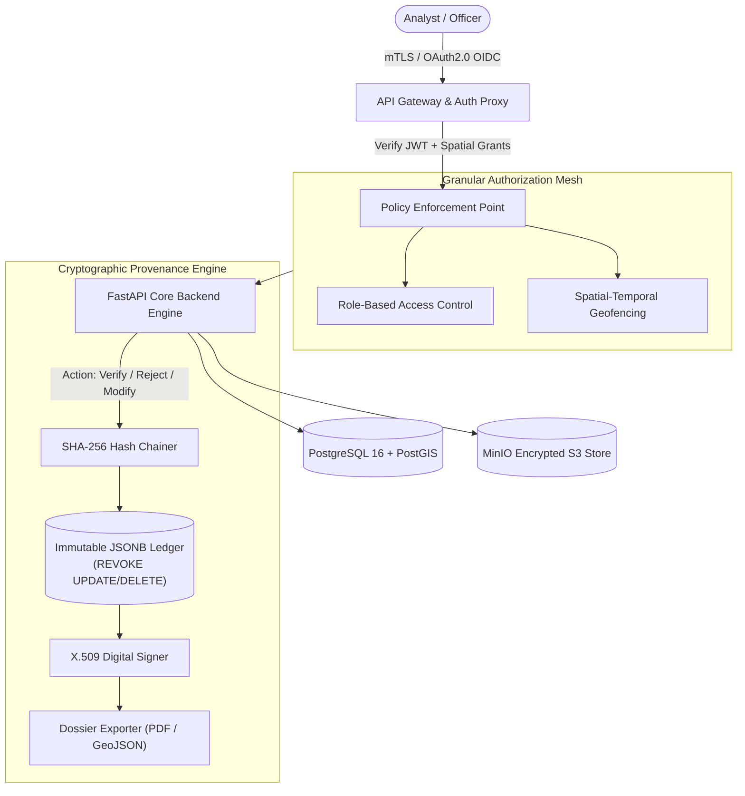

# Architecture: Security, RBAC & Audit Provenance

**Document ID:** `ARCH-04`  
**System:** Geospatial Intelligence Platform (SIH Problem Statement ID: 26227)  
**Classification:** Confidential / Defense & Strategic Infrastructure Specification  
**Status:** Approved  
**Related Components:** [`FEAT-06`](../features/FEAT-06-human-in-the-loop.md), [`04-audit-and-export.md`](../dashboards/04-audit-and-export.md)

---

## 1. Security Architecture & Threat Model

Geospatial intelligence platforms handling high-resolution satellite imagery, strategic borders, critical infrastructure assets, and surveillance analytics operate under strict confidentiality, integrity, and availability mandates. 

In compliance with **SIH PS 26227** defense standards, this system enforces **Multi-Level Security (MLS)**, air-gapped network readiness, granular spatial-temporal access control, and an immutable cryptographic audit ledger preventing repudiation and tampering.



---

## 2. Authentication & Authorization Framework

### 2.1 Identity Management
- **Air-Gapped SSO:** Integrated with local **Keycloak** or Enterprise Active Directory / LDAP over TLS 1.3.
- **Tokens:** Short-lived JSON Web Tokens (JWT, 15-minute expiry) paired with opaque refresh tokens stored in HTTP-only, `SameSite=Strict` secure cookies.
- **Multi-Factor Authentication (MFA):** FIDO2 / WebAuthn hardware tokens (YubiKey) or TOTP mandatory for analyst and administrator profiles.

### 2.2 Role-Based Access Control (RBAC) Matrix

| Role | Browse Imagery | Semantic Search | Review & Confirm | Modify Polygon | Export Dossiers | Manage Ingestion & Node Mesh |
| :--- | :---: | :---: | :---: | :---: | :---: | :---: |
| **Super Administrator** | Yes | Yes | No | No | Yes | **Full Admin** |
| **Senior Intelligence Analyst** | Yes | Yes | **Yes** | **Yes** | **Yes** | Read-Only Telemetry |
| **Field Verification Officer** | Restricted AOI | Yes | **Yes** | No | Restricted AOI | None |
| **Compliance Auditor** | View Only | No | View Only | View Only | Full Audit Log | Read-Only Logs |
| **Read-Only Observer** | Public Tier | Limited | No | No | Watermarked Only | None |

### 2.3 Attribute-Based & Spatial-Temporal Access Control (ABAC)
Beyond roles, access to high-resolution rasters ($<1\text{m}$ resolution) and sensitive military/border installations is bounded by spatial-temporal predicates:

```sql
-- Spatial-temporal authorization check executed at query planning
CREATE OR REPLACE FUNCTION verify_analyst_spatial_access(
    p_analyst_id UUID,
    p_target_geometry GEOMETRY,
    p_acquisition_date TIMESTAMP WITH TIME ZONE
) RETURNS BOOLEAN AS $$
BEGIN
    RETURN EXISTS (
        SELECT 1 FROM analyst_spatial_grants g
        WHERE g.analyst_id = p_analyst_id
          AND ST_Contains(g.authorized_polygon, p_target_geometry)
          AND p_acquisition_date BETWEEN g.valid_from AND g.valid_until
          AND g.is_revoked = FALSE
    );
END;
$$ LANGUAGE plpgsql SECURITY DEFINER;
```

---

## 3. Immutable Cryptographic Provenance Ledger

When an analyst confirms, rejects, or adjusts a change detection alert, the decision must be permanently recorded with mathematical non-repudiation.

### 3.1 Hash Chaining Mechanism
Every audit entry incorporates the cryptographic hash of the immediate predecessor record:

$$H_i = \text{HMAC-SHA256}\Big(K_{\text{system}}, H_{i-1} \parallel \text{UUID}_i \parallel \text{Action}_i \parallel \text{Timestamp}_i \parallel \text{GeometryHash}_i \parallel \text{AnalystID}_i\Big)$$

If any historical record is modified or deleted directly in the database, the hash chain breaks instantly, alerting auditors during automated integrity verification passes.

### 3.2 Database Schema & Append-Only Enforcement

```sql
-- Table definition for immutable audit ledger
CREATE TABLE change_audit_ledger (
    entry_id UUID PRIMARY KEY DEFAULT gen_random_uuid(),
    event_id UUID NOT NULL REFERENCES detected_change_events(event_id),
    sequence_num BIGSERIAL NOT NULL,
    previous_hash VARCHAR(64) NOT NULL,
    current_hash VARCHAR(64) NOT NULL,
    analyst_id UUID NOT NULL REFERENCES user_profiles(user_id),
    analyst_action VARCHAR(32) NOT NULL, -- CONFIRMED, REJECTED_FALSE_POSITIVE, MODIFIED_GEOMETRY
    confidence_at_review NUMERIC(4, 3) NOT NULL,
    justification_code VARCHAR(64),
    analyst_notes TEXT,
    modified_geometry GEOMETRY(MultiPolygon, 4326),
    model_metadata JSONB NOT NULL,       -- Model weights hash, inference timestamp, sensor band configuration
    client_ip_hash VARCHAR(64) NOT NULL,
    created_at TIMESTAMP WITH TIME ZONE DEFAULT CURRENT_TIMESTAMP NOT NULL
);

-- Strict revocation of destructive permissions on audit tables
REVOKE UPDATE, DELETE, TRUNCATE ON change_audit_ledger FROM public, app_backend_user;
GRANT INSERT, SELECT ON change_audit_ledger TO app_backend_user;
```

---

## 4. Encryption Architecture

### 4.1 Data in Transit
- **TLS 1.3 Only:** Ciphers restricted to `TLS_AES_256_GCM_SHA384` and `TLS_CHACHA20_POLY1305_SHA256`.
- **Internal Microservice Mesh:** Mutual TLS (mTLS) with internal Certificate Authority (CA) authenticating FastAPI endpoints, Celery workers, Redis queues, and TiTiler tile proxies.

### 4.2 Data at Rest
- **Object Storage (MinIO):** Server-Side Encryption with KMS (SSE-KMS) using AES-256 keys managed by local HashiCorp Vault or PKCS#11 compliant Hardware Security Modules (HSM).
- **PostgreSQL Database:** Linux LUKS full-disk volume encryption combined with column-level encryption (`pgcrypto`) for target annotations and identity hashes.

---

## 5. Non-Repudiable Dossier Generation

Exported operational packages (generated via [`FEAT-06`](../features/FEAT-06-human-in-the-loop.md) and [`04-audit-and-export.md`](../dashboards/04-audit-and-export.md)) undergo formal signing:

1. **PDF Dossiers:** Injected with an X.509 digital signature conforming to PAdES-LTV (Long Term Validation) standards, timestamped against an internal RFC 3161 Time-Stamp Authority (TSA).
2. **GeoJSON Exports:** Emitted with an appended `provenance_signature` block containing the SHA-256 digest of all coordinates and properties signed with the reviewing analyst’s keypair.
3. **Verification QR Code:** A machine-readable verification code stamped on each PDF page linking directly to the immutable record ID in the offline provenance ledger.
