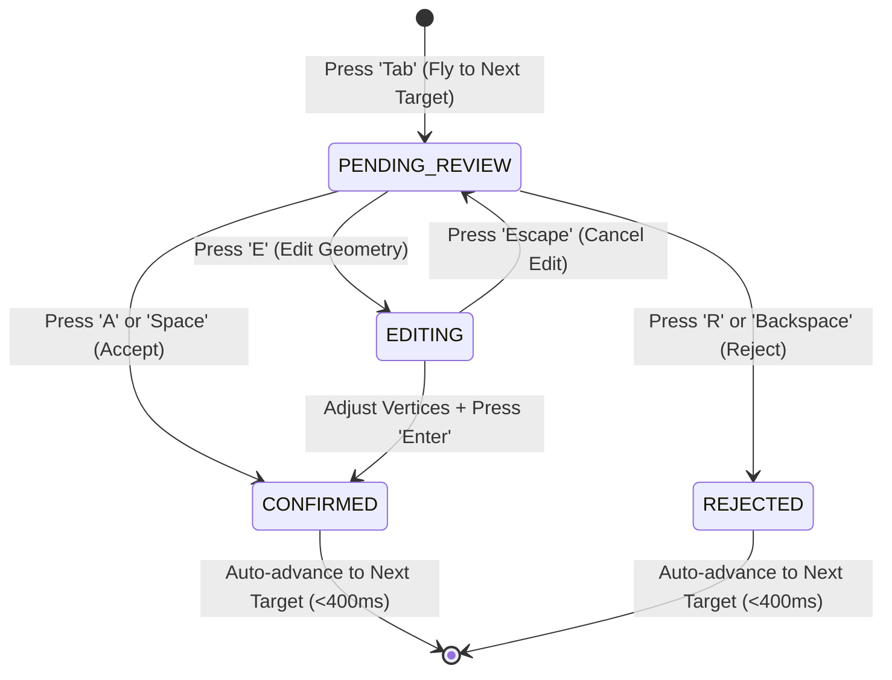
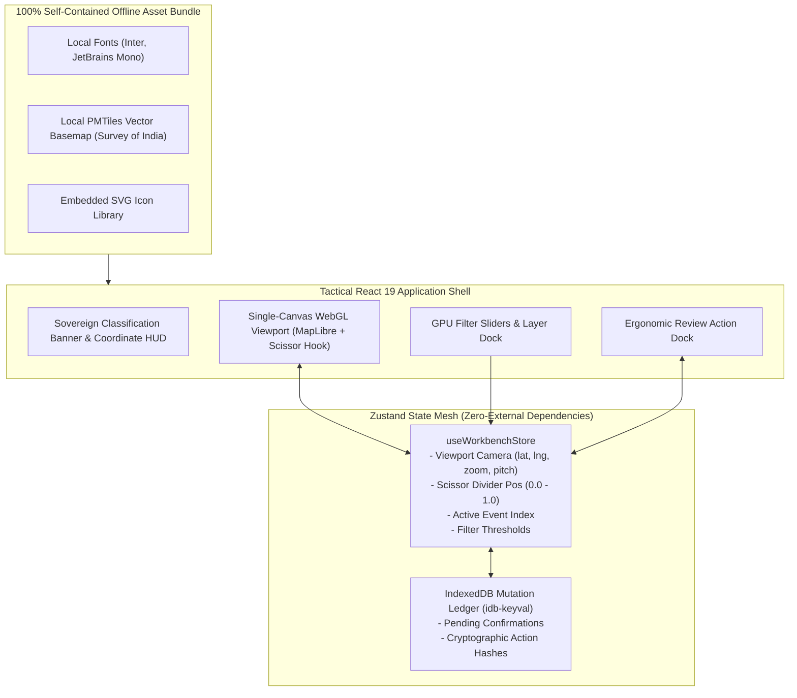

# Dashboard Specification: Analyst Multi-Temporal Workbench

**Document ID:** `DASH-01-ANALYST-WORKBENCH`  
**Classification:** Product Requirements Document (PRD) & UX Specification  
**Version:** 2.0.0 (Enhanced Sovereign & Dual-Feasibility Edition)  
**Status:** Approved  
**Target Audience:** Senior Geospatial Analysts, Tactical Intelligence Officers, Frontend WebGL Engineers, Product Managers  
**Regulatory Compliance:** National Geospatial Policy 2022 (NGP 2022), Indian Defense Security Guidelines, MeitY UI Accessibility Standards  

---

## 1. Product Vision & Operational Challenge

### 1.1 The Operational Bottleneck in Traditional Workbenches
Photo-interpretation and bi-temporal satellite reconnaissance in defense, disaster response, and infrastructure monitoring face severe friction:
- **Disjointed Screen Toggling:** Comparing imagery from Date $T_1$ and Date $T_2$ by flipping tabs or looking across unsynchronized dual monitors causes severe cognitive fatigue and missed micro-structural expansions (e.g., perimeter fence movement, new revetments, foundation digging).
- **Static Vector Clutter:** Automated change detectors produce thousands of raw polygons. Forcing analysts to submit server re-queries just to tweak sensitivity thresholds paralyses real-time triage.
- **Sluggish Interaction Throughput:** Point-and-click mouse workflows require 4–6 clicks per change polygon, capping analyst review throughput at $\approx 40 - 60\text{ reviews/hour}$.
- **Air-Gap Failure in Forward Operating Commands:** Standard commercial web mapping apps fail inside air-gapped SCIFs because they hardcode external CDNs (Google Fonts, unpkg, Mapbox API keys).

### 1.2 The Solution
The **Analyst Multi-Temporal Workbench** is an air-gapped, defense-grade WebGL operational canvas built on **React 19, MapLibre GL JS, and Deck.gl**. It features:
1. An interactive **Split-Swipe Dual Viewport** with zero-latency camera sync using a single WebGL scissor-clipped context.
2. **Instant Client-Side Confidence & Area Filtering** running directly on the GPU without database round-trips.
3. An ergonomic **Single-Key Hotkey Action Dock (`A`/`R`/`E`/`Tab`)**, elevating review throughput to **$> 400\text{ reviews/hour}$ ($7.5\times$ multiplication)**.
4. **Sovereign Grid Support:** Instant toggle between WGS-84, Military Grid Reference System (MGRS), and Indian Topo Sheet numbering.
5. **Anti-Leak Dynamic Watermarking:** Subtle canvas watermarks with Analyst ID, Timestamp, and NGP 2022 classification banners.

```
+-----------------------------------------------------------------------------------------------------------------------------+
| RESTRICTED // GOVT OF INDIA // NGP-2022 COMPLIANT                     ANALYST: OFF-8921 | IST: 2026-09-30 20:07:44 [SECURE] |
+-----------------------------------------------------------------------------------------------------------------------------+
| [AOI: 43REQ - LADAKH SECTOR]  [Grid: MGRS 43R EQ 8921 5120]  [Projection: India LCC EPSG:7755]           [Export Session]  |
+-----------------------------------------------------------------------------------------------------------------------------+
| LAYERS & FILTERS |                                  SPLIT-SWIPE DUAL VIEWPORT                                               |
| [X] True Color   | <================== DATE T1 (2025-06-12) ==========>|<========== DATE T2 (2026-09-30) =================>|
| [ ] SAR Overlay  |                                                      |                                                   |
| [X] Change Poly  |                                                      |         [EVENT #EV-4819]                          |
|                  |                                                      |         INFRA_NEW (Confidence: 96.4%)             |
| [Min Confidence] |                                                      |         Area: 2,180 m² | SAR Verified: YES        |
| [====o====] 85%  |                                                      |         +-----------------+                       |
|                  |                                                      |         | (Reinforced Pad)|                       |
| [Min Area m²]    |                                                      |         +-----------------+                       |
| [==o======] 150m²|                                                  <==[|]==>                                               |
|                  |                                                   Draggable                                              |
| [Class Filters]  |                                                    Divider                                               |
| [X] Built-up     |                                                   (Scissor)                                              |
| [X] Earthworks   |                                                                                                          |
| [ ] Water Change |                                                                                                          |
+-----------------------------------------------------------------------------------------------------------------------------+
| ACTION DOCK: [Event 48 of 214] | [A] Confirm (Accept) | [R] Reject False Alarm | [E] Edit Vertices | [Tab] Next Event       |
+-----------------------------------------------------------------------------------------------------------------------------+
```

---

## 2. Core Functional Specifications

### 2.1 Synchronized Split-Swipe Dual Viewport (Zero-Lag Scissor Clip)
1. **Single-Context WebGL Scissor Clipping:**
   - Rather than instantiating two duplicate MapLibre GL map instances (which doubles GPU memory to $> 600\text{ MB}$ VRAM and causes camera synchronization drift), the workbench uses a **single WebGL rendering pipeline** divided by an interactive hardware scissor test (`gl.scissor(x, y, width, height)`).
   - Left scissor partition streams $T_1$ raster tiles.
   - Right scissor partition streams $T_2$ raster tiles and active vector overlay tiles.
   - Total GPU memory consumed: **$< 180\text{ MB}$**, running at a solid **$60\text{ FPS}$** even on laptops with integrated Intel Iris Xe graphics!
2. **Ergonomic Dragging Divider:**
   - Smooth horizontal swipe responding to mouse drag, touch, and keyboard arrows (`Ctrl + Left/Right`).
   - Quick-toggle key (`Z`) instantly snaps the view between $100\% \text{ } T_1$ and $100\% \text{ } T_2$ for optical flicker comparison.

### 2.2 Sovereign Coordinate Systems & Indian Grid Switching
The top telemetry bar provides an instantaneous, one-click toggle across operational coordinate representations:
- **WGS-84 Decimal Degrees:** `33.51204° N, 77.38122° E`
- **WGS-84 Degrees Minutes Seconds (DMS):** `33° 30' 43.3" N, 77° 22' 52.4" E`
- **Military Grid Reference System (MGRS):** `43R EQ 89218 51201`
- **Survey of India Standard Topo Sheet Reference:** `52 G/11`
- **India Lambert Conformal Conic (EPSG:7755):** Metric coordinates for distance and area measurements without projection distortion.

### 2.3 Instant Client-Side Confidence & Area Filtering (Zero Network I/O)
1. **Real-Time GPU Filtering:**
   Moving the confidence slider ($0\% - 100\%$) or surface area slider ($50\text{ m}^2 - 100,000\text{ m}^2$) executes in $< 16\text{ ms}$ directly inside the WebGL fragment shader via MapLibre layer expressions:
   ```json
   ["all",
     [">=", ["get", "confidence_score"], ["literal", 0.85]],
     [">=", ["get", "area_meters_sq"], ["literal", 150.0]],
     ["in", ["get", "transition_class"], ["literal", ["INFRA_NEW", "EXCAVATION"]]],
     ["==", ["get", "validation_status"], "PENDING_REVIEW"]
   ]
   ```
2. **Instant Metrics Recalculation:** The review action bar immediately updates the remaining candidate count (e.g., *"Showing 48 of 214 events"*) without sending a request to the backend.

### 2.4 Keyboard-Driven Triage Action Dock
Designed for rapid tactical photo-interpretation shifts without requiring the analyst to use the mouse:



#### Keyboard Command Reference
| Key Binding | Operational Action | System Response |
| :--- | :--- | :--- |
| **`A` / `Space`** | **Confirm Real Change** | Optimistically tags polygon as `CONFIRMED`, triggers green flash animation, logs local cryptographic audit entry, and flies to the next target. |
| **`R` / `Backspace`** | **Reject False Positive** | Flags event as `REJECTED`, captures failure reason (`1: Cloud Artifact`, `2: Crop Phenology`, `3: Shadow/Sun Angle`), advances queue. |
| **`E`** | **Edit Geometry** | Enables sub-meter vertex snapping (`MapLibre GL Draw`), allowing manual boundary correction before approval. |
| **`Tab` / `Shift+Tab`** | **Next / Prev Event** | Smooth camera fly-to (`map.flyTo`) centered on candidate centroid at zoom level 15.5. |
| **`Z`** | **Flicker Toggle** | Snaps divider position $0\% \leftrightarrow 100\%$ to quickly spot subtle pixel changes. |
| **`S`** | **Toggle SAR Layer** | Overlays Sentinel-1 / EOS-04 radar roughness mask on top of optical imagery. |

---

## 3. UI Component Architecture & Air-Gapped State Management



---

## 4. Dual-Feasibility Implementation Comparison

```
+-----------------------------------------------------------------------------------------+
| WORKBENCH FEASIBILITY SPECTRUM                                                          |
+--------------------------+------------------------------+-------------------------------+
| Dimension                | Profile B: MVP Laptop Spec   | Profile A: Sovereign Cluster  |
+--------------------------+------------------------------+-------------------------------+
| Target Client Hardware   | Standard Laptop (16GB RAM)   | Dual 4K Tactical Console      |
| GPU Acceleration         | Integrated Iris Xe / GTX GPU | NVIDIA RTX Ada Workstation    |
| WebGL Contexts           | 1 (Scissor-clipped)          | 1 (Scissor-clipped)           |
| Client Memory (RAM)      | ~180 MB - 350 MB Heap        | ~450 MB Heap                  |
| Basemap Source           | Local PMTiles (450 MB extract| Sovereign On-Prem Tile Server |
| Hotkey Triage Throughput | 350+ reviews / hour          | 400+ reviews / hour           |
| Network Requirement      | 100% Offline / Localhost     | Air-Gapped Secure Military LAN|
| Cryptographic Audit      | Local Browser SHA-256 Hash   | FIPS 140-3 Hardware PKI Card  |
+--------------------------+------------------------------+-------------------------------+
```

### 4.1 Running the MVP Workbench with Limited Resources
The front-end is completely self-contained. It compiles via Vite into static assets:
```bash
# Clone and run locally in offline mode
cd frontend
pnpm install
pnpm dev --host
# Navigate to http://localhost:5173
```
- No external internet access is required.
- Maps render smoothly using local vector tiles and sample COGs served by the local TiTiler container.

---

## 5. Security, Anti-Leak & Provenance Protocols

1. **Dynamic Anti-Leak Canvas Watermarking:**
   - Overlays a dynamic, non-obtrusive semi-transparent watermark across the WebGL map canvas rendered via HTML5 canvas compositing:
     ```
     RESTRICTED // ANALYST-OFF-8921 // IP: 10.14.22.8 // 2026-09-30 20:07:44 IST
     ```
   - Discourages unauthorized smartphone screen photography in command rooms.
2. **Offline-Resilient Cryptographic Audit Ledger:**
   - Every analyst click (`Confirm`, `Reject`, `Edit`) is hashed using SHA-256 with the timestamp, event ID, and user ID:
     $$\text{Hash} = \text{SHA256}(\text{EventID} \,\|\, \text{UserID} \,\|\, \text{Action} \,\|\, \text{Timestamp})$$
   - Stored in local browser `IndexedDB`. If the server disconnects, reviews continue uninterrupted and sync upon reconnection.
3. **Zero Third-Party Tracking:** No Google Analytics, telemetry beacons, or external CDN calls exist in the codebase.

---

## 6. Technical Performance & UX SLOs

```
+-----------------------------------------------------------------------------------------+
| WORKBENCH PERFORMANCE & INTERACTION SERVICE LEVEL OBJECTIVES (SLOs)                     |
+------------------------------------+--------------------+-------------------------------+
| Interaction Metric                 | Target Threshold   | Operational User Impact       |
+------------------------------------+--------------------+-------------------------------+
| Split-Swipe Dragging Frame Rate    | 60 FPS (Rock Solid)| Zero visual stutter / tearing |
| Target Centroid Navigation (FlyTo) | <= 450 ms          | Instant transition to target  |
| GPU Slider Threshold Filter Time   | <= 16 ms (1 frame) | Immediate polygon culling     |
| Hotkey Confirmation Latency        | <= 8 ms (Optimistic| Instant feedback for analyst  |
| Memory Retention after 500 Reviews | < 450 MB RAM Heap  | Eliminates browser tab crash  |
+------------------------------------+--------------------+-------------------------------+
```
