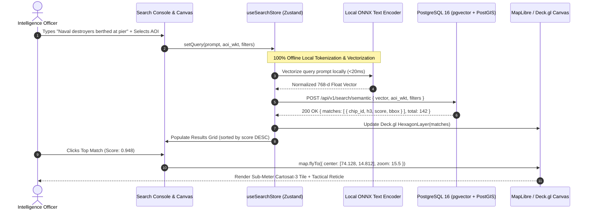

# Dashboard Specification: Semantic Intelligence Search Explorer

**Document ID:** `DASH-02-INTELLIGENCE-SEARCH`  
**Classification:** Product Requirements Document (PRD) & UX Specification  
**Version:** 2.0.0 (Enhanced Sovereign & Dual-Feasibility Edition)  
**Status:** Approved  
**Target Audience:** All-Source Intelligence Analysts, Defense Operations Planners, Maritime Watch Officers, Frontend Engineers  
**Regulatory Compliance:** National Geospatial Policy 2022 (NGP 2022), Defense Intelligence Security Standards, MeitY Guidelines  

---

## 1. Product Vision & Operational Challenge

### 1.1 The Operational Bottleneck in Satellite Discovery
In traditional Earth Observation archives, searching for tactical ground entities—such as *"unpaved mountain airstrips with fuel bladders"*, *"coastal naval drydocks with berthed destroyers"*, or *"unauthorized riverbed sand dredging operations"*—faces crippling friction:
- **Alphanumeric Filter Paralysis:** Catalogs only accept metadata filters (`date`, `cloud_cover`, `sensor_id`, `bbox`). They cannot interpret terrain shapes, visual structures, or tactical semantics.
- **Needle-in-a-Haystack Manual Sweeps:** Finding an uncatalogued target across a $50,000\text{ km}^2$ border corridor requires days of visual panning, costing hundreds of analyst man-hours ($\approx \text{₹ } 8 - 12\text{ Lakhs}$ in operational labor).
- **Public Cloud LLM Leakage:** Commercial AI search solutions call external SaaS APIs (OpenAI, Anthropic, or external HuggingFace endpoints). Sending queries like *"missile silo near border X"* to a third-party server represents an unacceptable national security breach.

### 1.2 The Solution
The **Semantic Intelligence Search Explorer** transforms multi-sensor satellite archives into an instantly searchable visual knowledge graph:
1. **100% Air-Gapped Natural Language Inference:** Analysts query archives using natural text prompts. Queries are vectorized locally on sovereign CPU/GPU via embedded **RemoteCLIP / Clay v1.5** models without any external API calls.
2. **Reverse Visual Similarity Dropzone:** Drag-and-drop reference chips (e.g., a known radar site or vessel silhouette) to find matching signatures across regional indices.
3. **Deck.gl Hexagonal Density Heatmaps:** Renders target density clusters across millions of square kilometers in real-time.
4. **Target Reticle Fly-To & Inspect:** One-click camera transition (`flyTo`) centering the high-resolution COG tile with spectral index inspection (NDVI, NDWI, NDBI).

```
+-----------------------------------------------------------------------------------------------------------------------------+
| RESTRICTED // SOVEREIGN INTELLIGENCE SEARCH // NGP-2022               QUERY MISSION CODE: IOR-MARITIME-26   [AIR-GAPPED]    |
+-----------------------------------------------------------------------------------------------------------------------------+
| [ Search: "naval destroyers berthed at concrete pier"  sensor:ISRO-CS3+S2  cloud:<10%  date:2026-Q3  gsd:<2m ]     [Search] |
+------------------------------------------------------------------+----------------------------------------------------------+
| SEARCH RESULTS (142 Matches)                     [Sort: Sim Score]| SPATIAL TACTICAL VIEWPORT                                |
| +--------------------------------------------------------------+ |                                                          |
| | CHIP #CS3-89218                Sim: 0.948 | Res: 0.28m GSD   | |      +-----------------------------------------+         |
| | [High-Res Thumbnail]          MGRS: 43R EQ 8921 5120         | |      | (Deck.gl Hexagonal Target Heatmap)      |         |
| | Lat: 14.812° N, Lon: 74.128° E Date: 2026-09-28               | |      |         [*** Karwar Naval Base ***]     |         |
| | [Fly To Target] [Add to Dossier] [Inspect Spectral Bands]    | |      |                                         |         |
| +--------------------------------------------------------------+ |      |             /\                          |         |
| | CHIP #CS3-89401                Sim: 0.924 | Res: 0.80m GSD   | |      |            /  \     [Operational AOI]   |         |
| | [High-Res Thumbnail]          MGRS: 43R EQ 8935 5144         | |      |           /____\                        |         |
| | Lat: 14.825° N, Lon: 74.142° E Date: 2026-09-28               | |      |                                         |         |
| | [Fly To Target] [Add to Dossier] [Inspect Spectral Bands]    | |      +-----------------------------------------+         |
| +--------------------------------------------------------------+ | [Draw BBox] [Draw Polygon] [Clear AOI]                   |
| | CHIP #S2-91024                 Sim: 0.887 | Res: 10.0m GSD   | | Active Tile: ISRO Cartosat-3 + Sentinel-2 Stream         |
+------------------------------------------------------------------+----------------------------------------------------------+
```

---

## 2. Core Functional Modules

### 2.1 Context-Aware Search Console with Sovereign Lexicon
1. **Hybrid Query Parsing Engine:**
   Combines natural language intent with strict geospatial parameter tokens:
   - `prompt`: Free-form natural language query.
   - `sensor:{isro-cartosat|isro-resourcesat|sentinel-2|all}`: Filters sensor constellation.
   - `cloud:<{percentage}`: Maximum permissible cloud occlusion (e.g., `cloud:<10%`).
   - `date:{range}`: ISO date brackets or quick-terms (`date:last-14-days`, `date:2026-Q3`).
   - `gsd:<{meters}`: Maximum spatial ground sample distance (e.g., `gsd:<1m` for sub-meter targets).
2. **Indian Defense & Civil Strategic Lexicon:**
   The offline auto-complete engine includes domain-specific lexicons mapped to foundation embedding clusters:
   - **Tactical Defense:** *"Surface-to-air missile radar revetment"*, *"trench fortification and defensive berm"*, *"high-altitude helipad and fuel bladder"*, *"hardened aircraft shelter (HAS)"*.
   - **Maritime Domain Awareness (IOR):** *"Guided missile frigate"*, *"berth crane"*, *"floating drydock"*, *"oil bunkering vessel"*.
   - **Civil Governance & Mining:** *"Riverbed sand mining excavation"*, *"illegal open-cast coal pit"*, *"highway right-of-way encroachment"*, *"forest canopy clearing"*.

### 2.2 Reverse Visual Similarity Search (Dropzone)
1. **Direct Image Chip Ingestion:** Analysts can drag-and-drop a cropped satellite thumbnail ($256 \times 256$ to $1024 \times 1024$ PNG/TIFF) directly into the search bar.
2. **Local Vision Inference:** The local vision backbone converts the chip into a 768-d unit vector in $< 25\text{ ms}$ on local GPU/CPU.
3. **k-NN Vector Retrieval:** Searches the regional database for visually and structurally identical installations across the country.

### 2.3 Deck.gl Hexagonal Density Heatmap & Spatial Clustering
1. **Dynamic Hexagonal Aggregation (`HexagonLayer`):**
   - Candidate chips are aggregated dynamically into hexagonal clusters representing target density.
   - Color Ramp: Low Density (Deep Indigo `#1E1B4B`) $\to$ Medium (Tactical Cyan `#00F0FF`) $\to$ High Density (Alert Amber `#F59E0B` to Threat Red `#FF1E44`).
   - Hexagon radius scales with map zoom level ($2,500\text{ m}$ at regional zoom down to $150\text{ m}$ at tactical zoom).
2. **Cluster HUD Tooltip:** Hovering over a hexagon displays total target count, mean cosine similarity score, and a quick thumbnail collage of top matching chips.

### 2.4 Synchronized Results Grid & Target Reticle Fly-To
1. **Tactical Chip Intelligence Cards:**
   - **Visual Thumbnail:** Instant WebP thumbnail with true-color or false-color infrared render.
   - **Similarity Score Badge:** Color-coded confidence pill ($\ge 90\%$ Emerald, $80-89\%$ Amber, $< 80\%$ Slate).
   - **Spatial Badges:** MGRS coordinate, acquisition date, sensor ID, GSD.
2. **Target Fly-To (`map.flyTo`):** Clicking a card triggers a smooth cubic-bezier camera transition to the exact chip centroid at Zoom 15.5. An animated tactical pulsar reticle highlights the target boundary.
3. **Inspect Spectral Indices Drawer:** Slides open a side inspector providing live NDVI (Vegetation), NDWI (Water), and NDBI (Built-up) false-color views streamed via TiTiler band arithmetic.

---

## 3. UI Component Architecture & Air-Gapped Flow



---

## 4. Dual-Feasibility Implementation Comparison

```
+-----------------------------------------------------------------------------------------+
| SEARCH EXPLORER FEASIBILITY SPECTRUM                                                    |
+--------------------------+------------------------------+-------------------------------+
| Dimension                | Profile B: MVP Laptop Spec   | Profile A: Sovereign Cluster  |
+--------------------------+------------------------------+-------------------------------+
| Text Encoder Backbone    | RemoteCLIP (ViT-B/32 ONNX)   | RemoteCLIP ViT-L/14 TensorRT  |
| Model Memory Footprint   | ~120 MB RAM (INT8 Quantized) | ~1.8 GB VRAM (Float16)        |
| Inference Execution      | CPU (AVX-512) or Mobile GPU  | NVIDIA L40S / A100 GPU        |
| Text Vectorization Time  | ~18 ms on modern CPU         | ~2.5 ms on GPU                |
| Vector Index Scale       | 25,000 local chips           | 50,000,000+ national chips    |
| Search Response Time     | P95 <= 110 ms                | P95 <= 45 ms                  |
| Query Confidentiality    | 100% Localhost Memory        | Air-Gapped Secure Enclave     |
+--------------------------+------------------------------+-------------------------------+
```

### 4.1 Running the MVP Search on a Standard Laptop
The search engine is completely self-contained. The text encoder runs in Python via `onnxruntime`:
```python
import onnxruntime as ort
import numpy as np

# Load lightweight 120MB INT8 quantized text encoder
session = ort.InferenceSession("models/remoteclip_text_int8.onnx")

def encode_query(prompt: str) -> list[float]:
    tokens = local_tokenizer(prompt) # Zero internet tokenizer
    inputs = {session.get_inputs()[0].name: tokens}
    raw_vec = session.run(None, inputs)[0]
    norm_vec = raw_vec / np.linalg.norm(raw_vec, axis=-1, keepdims=True)
    return norm_vec.flatten().tolist()
```
Runs in **$< 18\text{ ms}$ on any standard laptop CPU**, proving full MVP viability without cloud GPUs!

---

## 5. Security & Query Privacy Protocols

1. **Query Intent Confidentiality:** In defense and intelligence operations, the query string itself reveals operational intent. All search queries are executed purely in volatile RAM, never cached in unencrypted third-party logs.
2. **Mandatory Mission Audit Trail:** Each query requires a `mission_authorization_code` (e.g., `IOR-MARITIME-26`). Queries are logged into an append-only cryptographic audit table in PostgreSQL to satisfy intelligence oversight mandates.
3. **Zero Third-Party Callouts:** Strict Content Security Policy (CSP) blocking all outbound network traffic outside the sovereign host.

---

## 6. Technical Performance & Usability SLOs

```
+-----------------------------------------------------------------------------------------+
| SEARCH EXPLORER SERVICE LEVEL OBJECTIVES (SLOs)                                         |
+------------------------------------+--------------------+-------------------------------+
| Performance Metric                 | Target Threshold   | Operational User Benefit      |
+------------------------------------+--------------------+-------------------------------+
| Natural Language Vectorization     | <= 25 ms (CPU/GPU) | Immediate query execution     |
| Hybrid Spatial-Vector Query (Top50)| <= 90 ms           | Instantaneous search results  |
| Deck.gl Heatmap Aggregation (50K)  | 60 FPS (WebGL)     | Fluid camera pan across India |
| Target Fly-To Camera Transition    | <= 500 ms          | Rapid visual confirmation     |
| WebP Chip Thumbnail Load Time      | <= 60 ms           | Zero UI card render lag       |
+------------------------------------+--------------------+-------------------------------+
```
