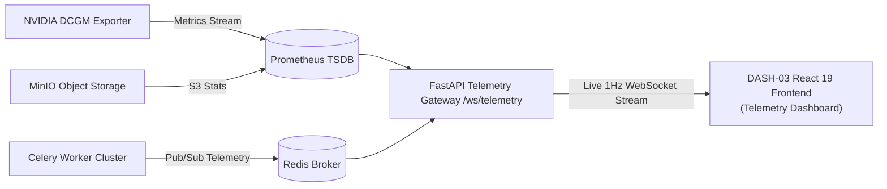

# Dashboard Specification: Ingestion & System Telemetry Monitor

**Dashboard ID:** `DASH-03`  
**Documentation File:** `docs/dashboards/03-ingestion-telemetry.md`  
**System:** Geospatial Intelligence Platform (SIH Problem Statement ID: 26227)  
**Target Users:** Platform Engineers, Systems Administrators, and DevOps Operations  
**Status:** Approved  
**Related Components:** [`FEAT-01`](../features/FEAT-01-cog-ingestion.md), [`ARCH-03`](../architecture/03-offline-inference-mesh.md)

---

## 1. Operational Purpose & User Persona

In an operational deployment handling satellite swaths spanning gigabytes to terabytes per acquisition cycle, platform operators need real-time situational awareness of:
1. **Asynchronous pipeline health:** Active ingest jobs, GDAL COG transformation bottlenecks, and H3 hexagonal tiling queues.
2. **Inference mesh performance:** Real-time VRAM allocation, GPU core temperatures, and batch inference throughput across Clay / RemoteCLIP / BIT worker nodes.
3. **Storage & vector indexing quotas:** Total indexed coverage ($\text{km}^2$), MinIO S3 bucket capacities, and PostgreSQL `pgvector` HNSW memory footprint.



---

## 2. Dashboard Layout & Component Hierarchy

The monitor is structured as a mission-control operations grid updating via WebSocket at a $1\text{ Hz}$ refresh rate:

```
+-------------------------------------------------------------------------------------------------------+
| INGESTION & INFERENCE MESH TELEMETRY                      [STATUS: OPERATIONAL] [WS: CONNECTED 12ms]   |
+-------------------------------------------------------------------------------------------------------+
| [ TOP KPI STRIP ]                                                                                     |
| ACTIVE INGEST JOBS: 14   | CHIPS INDEXED (24h): 1,420,900 | TOTAL AREA: 48,200 km² | VRAM ALLOC: 68%  |
+-------------------------------------------------------------------------------------------------------+
| [ PROGRESSIVE VERIFICATION FUNNEL (FAST -> BALANCED -> DEEP) ]                                        |
| ⚡ FAST STAGE (k-NN Cosine): 1,420,900 chips screened [=========================> 100%] (Avg: 184ms) |
| ⚖️ BALANCED (Multi-Temporal): 14,200 candidates verified [=====> 1.0%] Persistent     (Avg: 1.2s)    |
| 🔬 DEEP STAGE (SAR + SAM 2.1): 412 confirmed structural alerts                         (Avg: 3.4s)    |
| ⚠️ NEEDS_REVIEW TRIAGE QUEUE: 68 events requiring human verification (SLA: < 2 hours)                 |
+-------------------------------------------------------------------------------------------------------+
| [ PIPELINE QUEUE FLOW (KANBAN / SANKEY) ]                                                             |
| Staging Uploads (3) ──> COG Deflate (4) ──> H3 Tiling (5) ──> Vector Embedding (2) ──> Indexed (OK)   |
| [===================> Progress: 72% - Scene: S2A_OPER_MSI_L2A_20260928T054001 - ETA: 4m 12s =====]  |
+------------------------------------------------------+------------------------------------------------+
| [ GPU CLUSTER VRAM & THERMAL GAUGES ]                | [ STORAGE & VECTOR METRICS ]                   |
| Node-01 (RTX 4090): 19.8 / 24 GB [==== 82% ====] 64°C | MinIO S3 'satellite-cogs': 4.8 TB / 10 TB      |
| Node-02 (RTX 4090): 14.2 / 24 GB [==== 59% ====] 58°C | PostGIS Vector Rows: 2,840,110 (pgvector)      |
| Node-03 (A100-80G): 54.1 / 80 GB [==== 67% ====] 51°C | HNSW Halfvec RAM Footprint: 4.3 GB (-50%)      |
| Node-04 (CPU Tiler): 32 Cores [====== 91% ======]    | Write IOPS: 1,240 ops/sec                      |
+------------------------------------------------------+------------------------------------------------+
| [ WORKER LOG STREAM & DEAD LETTER QUEUE (DLQ) ]                                                       |
| [20:00:12] INFO  [Worker-03] Embedding batch #4829 completed (64 chips in 142ms)                     |
| [20:00:14] WARN  [Worker-01] Scene S2B_38TPN: Cloud cover 78% exceeds optimal threshold              |
| [20:00:19] INFO  [Worker-02] ChangeFormer bi-temporal comparison passed for Grid cell #8812a          |
+-------------------------------------------------------------------------------------------------------+
```

---

## 3. Key Components & Specifications

### 3.1 Real-Time Pipeline Visualizer
- **Component ID:** `IngestionPipelinePipeline`
- **Visualization:** Dynamic stage-based flow chart tracking live task states:
  - `STAGING_RECEIVED`
  - `COG_CONVERSION_DEFLATE`
  - `H3_HEX_CHIP_GENERATION`
  - `EMBEDDING_INFERENCE`
  - `DATABASE_REGISTRATION`
- **Interactions:** Operators can click any active ingestion pipeline run to inspect the stack trace, cancel runaway jobs, or adjust Celery priority.

### 3.2 Hardware & VRAM Telemetry Hub
- **Component ID:** `GpuClusterTelemetryGauges`
- **Metrics Tracked:**
  - GPU Core Temperature ($^\circ\text{C}$) with automatic high-temp warning banners ($>82^\circ\text{C}$).
  - VRAM Utilization ($\text{Allocated GiB} / \text{Total GiB}$).
  - Tensor Core Compute Saturation ($\%$).
  - PCIe Bus Bandwidth ($\text{GB/s}$).

### 3.3 Storage Quotas & Index Volume
- **Component ID:** `StorageVolumeBreakdown`
- **Metrics Tracked:**
  - Total Ground Area Processed ($\text{km}^2$) computed via PostGIS `ST_Area(ST_Union(footprint))`.
  - Number of indexed 768-d vector embeddings in `satellite_chips`.
  - HNSW graph memory residency and index fragmentation percentage.
  - S3 staging vs. archive bucket utilization.

---

## 4. WebSocket Communication Protocol

### Connection URL
`ws://localhost:8000/api/v1/ws/telemetry`

### Telemetry Packet Payload (JSON)
```json
{
  "timestamp": "2026-09-30T20:00:00Z",
  "active_jobs": {
    "staging_count": 3,
    "cog_transforming": 4,
    "tiling_active": 5,
    "embedding_queue": 2,
    "dlq_errors": 0
  },
  "nodes": [
    {
      "node_id": "gpu-worker-node-01",
      "device": "NVIDIA GeForce RTX 4090",
      "vram_used_bytes": 21260000000,
      "vram_total_bytes": 25769803776,
      "gpu_utilization_pct": 84,
      "temperature_c": 64,
      "current_task": "CLAY_V15_EMBED_BATCH"
    }
  ],
  "storage": {
    "total_area_km2": 48200.5,
    "vector_count": 2840110,
    "s3_bytes_used": 5277655810048,
    "hnsw_mem_bytes": 9234120704
  }
}
```
