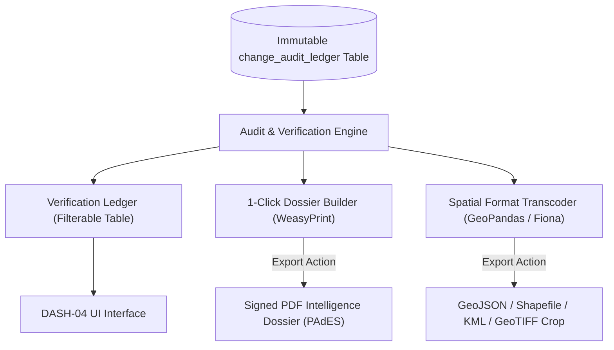

# Dashboard Specification: Audit Trails & Dossier Exporter

**Dashboard ID:** `DASH-04`  
**Documentation File:** `docs/dashboards/04-audit-and-export.md`  
**System:** Geospatial Intelligence Platform (SIH Problem Statement ID: 26227)  
**Target Users:** Lead Intelligence Officers, Compliance Auditors, and Command Decision Makers  
**Status:** Approved  
**Related Components:** [`FEAT-06`](../features/FEAT-06-human-in-the-loop.md), [`ARCH-04`](../architecture/04-security-and-audit.md)

---

## 1. Operational Purpose & User Persona

In high-consequence defense and border monitoring operations (**SIH PS 26227**), command decision-makers and compliance oversight officials require:
1. **Unassailable Chain of Custody:** A tamper-evident verification ledger displaying every analyst intervention, confirmation, rejection, and geometric modification.
2. **Instant Intelligence Dossier Generation:** The ability to convert raw change alerts and analyst findings into signed, multi-page executive intelligence briefings with zero manual report formatting.
3. **Interoperable Data Dissemination:** Seamless export of verified spatial assets to standard defense and GIS formats (ESRI Shapefile, GeoJSON, KML, and georeferenced GeoTIFF crops) for ingestion into tactical GIS software (e.g., QGIS, ArcGIS Pro, FalconView).



---

## 2. Dashboard Layout & Component Architecture

```
+-------------------------------------------------------------------------------------------------------+
| AUDIT TRAILS & INTELLIGENCE DOSSIER EXPORTER                  [AUDIT COMPLIANCE: 100% HASH-VERIFIED]   |
+-------------------------------------------------------------------------------------------------------+
| [ FILTER & SEARCH BAR ]                                                                               |
| Sector / AOI: [Northern Border ▼] | Date Range: [2026-08-01 to 2026-09-30] | Action: [CONFIRMED ▼]    |
| Analyst ID: [All Analysts ▼]      | Triage Tier: [Needs Review & Confirmed ▼] | Search Query: [Runway]|
+-------------------------------------------------------------------------------------------------------+
| [ VERIFICATION AUDIT LEDGER ]                                                                         |
| SEQUENCE | EVENT ID | TIMESTAMP (UTC)      | ANALYST          | ACTION      | TRIAGE TIER | HASH SIGN |
| #1042    | 8f3b...  | 2026-09-30 18:24:02  | Capt. R. Sharma  | CONFIRMED   | URGENT_CONF | a89f [OK] |
| #1041    | e71a...  | 2026-09-30 17:15:10  | Lt. A. Mehta     | REJECTED_FP | AUTO_SUPPR  | d11b [OK] |
| #1040    | 33c0...  | 2026-09-30 16:40:48  | Capt. R. Sharma  | REVIEW_ESC  | NEEDS_REV   | 76fe [OK] |
+-------------------------------------------------------------------------------------------------------+
| [ SELECTED EVENT INSPECTION PANEL & EVIDENCE SCORECARD ]                                              |
| Event: #1042 - Runway Extension | Coordinates: 34.1204° N, 74.8912° E | GSD: 10m (Sentinel-2A)        |
| ──> STAGE 1 (Fast Semantic Vector Score)      : 0.914 (High similarity to military runway airstrip)  |
| ──> STAGE 2 (Balanced Temporal Persistence)   : 0.880 (Persistent across passes Aug 10 -> Sep 15)   |
| ──> STAGE 3 (Deep SAR Backscatter Delta)      : +3.82 dB (Confirmed double-bounce corner reflection)  |
| Sensor Metadata: Sun Azimuth: 142.1° | Sun Elevation: 58.4° | Cloud Obscuration: 0.0%                 |
| Hash Chain: Prev: 04e3... -> Current: a89f...21c | Digital Cert: CN=R_SHARMA_GOV_IN, OU=INDIAN_ARMY   |
+-------------------------------------------------------------------------------------------------------+
| [ MULTI-FORMAT EXPORT ACTION CONSOLE ]                                                                |
| [ 📄 GENERATE SIGNED PDF DOSSIER ]   [ 🌐 EXPORT GEOJSON ]   [ 🗺️ EXPORT SHAPEFILE ]                  |
| [ 📊 EXPORT EVIDENCE CSV / JSON ]    [ 🛰️ EXPORT COG CUTOUT ] [ 🌍 EXPORT KML / KMZ ]                |
+-------------------------------------------------------------------------------------------------------+
```

---

## 3. Key Components & Capabilities

### 3.1 Verification Ledger Table
- **Component ID:** `AuditLedgerTableView`
- **Features:**
  - Real-time client-side cryptographic integrity verification: green badge indicator confirming SHA-256 hash unbroken chain.
  - Sorting and multi-column filtering by analyst rank, action category, confidence threshold, and geospatial bounding polygon.
  - Inline expansion displaying analyst notes, justification tags, and previous vs. modified vector boundaries.

### 3.2 Automated Dossier Generator
- **Component ID:** `DossierGenerationModal`
- **Capabilities:**
  - Compiles an executive brief conforming to national defense documentation standards.
  - Embeds dual-timestamp $512\times 512$ optical chips, SAR backscatter correlation plots, and vector boundary footprints.
  - Signs the final PDF artifact using the reviewing officer's client certificate and RFC 3161 timestamp authority.

### 3.3 Multi-Format GIS Asset Exporter
- **Component ID:** `GisExportDropdown`
- **Supported Formats:**
  1. **GeoJSON (`.geojson`):** Normalized FeatureCollection including full provenance properties and confidence scores.
  2. **ESRI Shapefile (`.shp` package in `.zip`):** Projected in EPSG:4326 with standard attribute table truncated to 10-char DBF constraints.
  3. **Keyhole Markup Language (`.kml` / `.kmz`):** Styled polygon overlays with popups for Google Earth and tactical field kits.
  4. **Orthorectified GeoTIFF Cutout (`.tif`):** 4-band (RGB-NIR) radiometric chip cropped to exact bounding box with embedded GeoTIFF metadata.

---

## 4. API Endpoints

### 4.1 Ledger Query Endpoint
`GET /api/v1/audit/ledger?sector=NORTH_01&action=CONFIRMED&limit=50`

### 4.2 Dossier Compilation Endpoint
`POST /api/v1/audit/events/{event_id}/generate-dossier`
- **Request Body:**
```json
{
  "classification_level": "RESTRICTED",
  "include_sar_telemetry": true,
  "include_active_learning_tags": false,
  "document_title": "STRATEGIC RUNWAY EXPANSION REPORT - SECTOR 4"
}
```
- **Response:** `application/pdf` binary stream with `Content-Disposition: attachment; filename="DOSSIER-8f3b2024.pdf"`.
