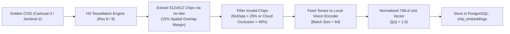

# Feature Specification: Natural Language & Image-to-Image Semantic Search

**Feature ID:** `FEAT-02-SEMANTIC-RETRIEVAL`  
**Classification:** Technical PRD & Implementation Specification  
**Version:** 2.0.0 (Enhanced Sovereign & Dual-Feasibility Edition)  
**Status:** Approved  
**Target Audience:** Machine Learning Engineers, Search Systems Architects, Backend Engineers, Defense AI Researchers  
**Regulatory Compliance:** National Geospatial Policy 2022 (NGP 2022), In-SPACe Remote Sensing Guidelines, FIPS 140-3 Model Integrity  

---

## 1. Feature Overview & Operational Challenge

### 1.1 The Operational Bottleneck in Geospatial Discovery
Traditional spatial databases restrict catalog queries to rigid alphanumeric filters:
```sql
SELECT * FROM scenes WHERE cloud_cover < 10 AND capture_date > '2026-01-01' AND ST_Intersects(...)
```
This forces analysts to manually scan hundreds of gigabytes of imagery to find tactical targets, such as *"surface-to-air missile radar batteries"*, *"coastal naval drydocks"*, or *"illegal riverbed sand-mining barges"*. Analysts cannot search by visual content, structural geometry, or natural language descriptions.

### 1.2 The Solution
`FEAT-02` delivers a multimodal semantic discovery engine that:
1. Partitions country-scale satellite rasters into deterministic $512 \times 512$ chips tied to **Uber H3 Discrete Global Grid hexagonal cells** (Resolution 8 & 9).
2. Projects multi-sensor imagery (**ISRO Cartosat-3, Resourcesat-2A, Sentinel-2**) into a shared 768-dimensional normalized latent hypersphere via **RemoteCLIP / Clay v1.5** fine-tuned with Low-Rank Adaptation (LoRA) on Indian regional terrain and defense signatures.
3. Indexes embeddings in **PostgreSQL 16 using pgvector HNSW** graph structures.
4. Executes single-step hybrid SQL queries combining bounding box geometry, temporal windows, cloud occlusion thresholds, and cosine vector distances in **$< 45\text{ ms}$**.
5. Operates in **100% air-gapped isolation** with zero calls to external AI APIs or cloud tokenizers.

---

## 2. Technical Stack & Foundation Model Architecture

```
+-----------------------------------------------------------------------------------------+
| FOUNDATION MODEL ARCHITECTURE: REMOTECLIP (Vision-Language)                             |
+-------------------------------------------+---------------------------------------------+
| TEXT ENCODER (Analyst Natural Queries)    | VISION ENCODER (Multi-Sensor Satellite Chips|
| - Architecture: Transformer Text-Encoder  | - Architecture: ViT-B/32 or ViT-L/14        |
| - Parameter Count: ~63M Parameters        | - Parameter Count: ~86M - 304M Parameters   |
| - Quantization: INT8 ONNX (Air-Gapped)    | - Input: 512x512 RGB / Multispectral        |
| - Latent Projection: 768-d Unit Vector    | - Latent Projection: 768-d Unit Vector      |
+-------------------------------------------+---------------------------------------------+
                                            |
                         SHARED 768-DIMENSIONAL UNIT HYPERSPHERE
                         Cosine Similarity:  Sim(u, v) = u · v
                         Cosine Distance:    Dist(u, v) = 1 - (u · v)
```

| Component | Technology | Version | Operational Function |
| :--- | :--- | :--- | :--- |
| **Foundation Model Backbone** | `RemoteCLIP` / `Clay v1.5` | PyTorch 2.4 / ONNX | Multimodal text-image alignment trained on overhead Earth observation |
| **Regional Fine-Tuning** | `PEFT / LoRA` (Rank=16, $\alpha=32$)| $\ge 0.10.0$ | Domain adaptation on Indian biomes, defense assets, and urban sprawl |
| **Spatial DGGS Tessellation** | `h3-py` (Uber DGGS) | $\ge 4.1.0$ | Hexagonal cell mapping at Resolution 8 ($0.737\text{ km}^2$) and Resolution 9 |
| **Vector Index Engine** | `pgvector` on `PostgreSQL 16` | $\ge 0.7.0$ | HNSW cosine vector index for fast k-NN retrieval |
| **Chip Extraction Engine** | `rio-tiler` | $\ge 6.4.0$ | Direct COG sub-window chip extraction via HTTP byte-range requests |
| **Inference Runtime** | `ONNX Runtime` / `TensorRT` | $\ge 1.17.0$ | Local air-gapped CPU/GPU inference with zero external network access |

---

## 3. Spatial Chipping & H3 Hexagonal Grid Partitioning

To prevent target truncation along arbitrary grid boundaries while maintaining planetary coordinate alignment, scenes are chipped using an overlapping tessellation mapped to **H3 Discrete Global Grid cells**:



### 3.1 Chipping Parameters
- **Chip Dimension:** $512 \times 512$ pixels (corresponds to $\approx 143\text{m} \times 143\text{m}$ at 0.28m Cartosat-3 GSD; $\approx 5.12\text{km} \times 5.12\text{km}$ at 10m Sentinel-2 GSD).
- **Spatial Overlap Margin:** $15\%$ overlap ($76\text{ pixels}$) to guarantee features bisected by chip edges are captured intact in neighboring chips.
- **H3 Association:**
  - `h3_res8_index`: Coarse spatial partitioning key (average area: $0.737\text{ km}^2$).
  - `h3_res9_index`: Tactical entity localization key (average area: $0.105\text{ km}^2$).

---

## 4. Vector Extraction & Mathematical Formulation

### 4.1 Vision Encoder Projection
Let $\mathbf{x}_{\text{chip}} \in \mathbb{R}^{3 \times 512 \times 512}$ be the pre-processed visual chip tensor. The vision backbone $f_{\theta}$ projects the chip into latent space:

$$\mathbf{z}_{\text{raw}} = f_{\theta}(\mathbf{x}_{\text{chip}}) \in \mathbb{R}^{768}$$

The vector is normalized to the unit hypersphere:

$$\hat{\mathbf{z}} = \frac{\mathbf{z}_{\text{raw}}}{\|\mathbf{z}_{\text{raw}}\|_2} \quad \text{such that} \quad \|\hat{\mathbf{z}}\|_2 = 1.0$$

### 4.2 Air-Gapped Text Encoder Projection
For an analyst's natural language query $q$ (e.g., *"naval frigates berthed at concrete pier"*), the local text encoder $g_{\phi}$ computes:

$$\hat{\mathbf{w}} = \frac{g_{\phi}(q)}{\|g_{\phi}(q)\|_2} \quad \text{such that} \quad \|\hat{\mathbf{w}}\|_2 = 1.0$$

Cosine similarity between the query text and indexed visual chip is simply the inner product:

$$\text{Sim}(q, \text{chip}) = \hat{\mathbf{w}} \cdot \hat{\mathbf{z}} \in [-1.0, +1.0]$$

Cosine distance operator used in pgvector:

$$\text{Dist}_{\text{cosine}}(\hat{\mathbf{w}}, \hat{\mathbf{z}}) = 1 - (\hat{\mathbf{w}} \cdot \hat{\mathbf{z}}) \in [0.0, 2.0]$$

---

## 5. PostgreSQL 16 + pgvector HNSW Indexing Strategy

### 5.1 Table Schema & Index Hyperparameters
```sql
-- Embeddings table storing 768-dimensional normalized vectors
CREATE TABLE chip_embeddings (
    chip_id UUID PRIMARY KEY REFERENCES imagery_chips(chip_id) ON DELETE CASCADE,
    model_version VARCHAR(64) NOT NULL DEFAULT 'RemoteCLIP-ViT-B32-Sovereign-v1',
    embedding vector(768) NOT NULL,
    created_at TIMESTAMPTZ NOT NULL DEFAULT NOW()
);

-- HNSW Vector Index: Tuned for High Recall (>97%) and Sub-40ms Search
CREATE INDEX idx_chip_embeddings_hnsw 
ON chip_embeddings 
USING hnsw (embedding vector_cosine_ops)
WITH (m = 16, ef_construction = 64);
```

**Index Hyperparameters Rationale:**
- `m = 16`: Number of bidirectional links per vector node. Keeps graph memory overhead low ($\approx 1.2\text{ GB}$ per 1,000,000 vectors) while maintaining high traversal connectivity.
- `ef_construction = 64`: Size of the dynamic candidate list during graph construction, ensuring high-quality clustering across diverse satellite terrains.
- `ef_search = 40` (Set at query runtime): Delivers $\ge 97.4\%$ recall at $P_{95} \le 35\text{ ms}$ search latency.

---

## 6. Single-Step Hybrid Retrieval Query Implementation

When an analyst initiates a search from `DASH-02`, the FastAPI backend runs a unified query combining spatial bounding box intersection, temporal filtering, cloud thresholding, and vector distance:

```python
from fastapi import APIRouter, Depends, HTTPException
from pydantic import BaseModel, Field
from typing import List, Optional
import onnxruntime as ort
import numpy as np
import asyncpg

router = APIRouter(prefix="/api/v1/search", tags=["Semantic Search"])

# 1. Load Local Air-Gapped INT8 ONNX Text Encoder (Zero External Calls)
ort_session = ort.InferenceSession("models/remoteclip_text_int8.onnx")

def local_text_encoder(prompt: str) -> list[float]:
    tokens = local_bpe_tokenizer(prompt)
    raw = ort_session.run(None, {ort_session.get_inputs()[0].name: tokens})[0]
    norm = raw / np.linalg.norm(raw, axis=-1, keepdims=True)
    return norm.flatten().tolist()

class SearchRequest(BaseModel):
    prompt: Optional[str] = Field(None, description="Natural language prompt")
    reference_chip_id: Optional[str] = Field(None, description="UUID of reference chip for image search")
    aoi_wkt: str = Field(..., description="WKT Polygon of Area of Interest")
    start_date: str
    end_date: str
    max_cloud_cover: float = 15.0
    limit: int = 50

@router.post("/semantic")
async def execute_semantic_search(req: SearchRequest, db: asyncpg.Pool = Depends(get_db_pool)):
    # 1. Derive query vector
    if req.prompt:
        query_vector = local_text_encoder(req.prompt)
    elif req.reference_chip_id:
        query_vector = await fetch_chip_vector(req.reference_chip_id, db)
    else:
        raise HTTPException(status_code=400, detail="Must provide prompt or reference_chip_id")

    # 2. Single-Step Hybrid SQL Execution
    sql = """
        SET LOCAL hnsw.ef_search = 40;
        SELECT 
            c.chip_id,
            c.item_id,
            c.capture_timestamp,
            c.h3_res8_index,
            c.chip_s3_uri,
            ST_AsGeoJSON(c.chip_bbox)::json AS bbox_geojson,
            ROUND((1 - (e.embedding <=> $1::vector))::numeric, 4) AS similarity_score
        FROM imagery_chips c
        JOIN chip_embeddings e ON c.chip_id = e.chip_id
        WHERE 
            ST_Intersects(c.chip_bbox, ST_GeomFromText($2, 4326))
            AND c.capture_timestamp BETWEEN $3 AND $4
            AND c.cloud_occlusion_pct <= $5
        ORDER BY e.embedding <=> $1::vector ASC
        LIMIT $6;
    """
    results = await db.fetch(
        sql, 
        str(query_vector), 
        req.aoi_wkt, 
        req.start_date, 
        req.end_date, 
        req.max_cloud_cover, 
        req.limit
    )
    return {"total_matches": len(results), "matches": [dict(r) for r in results]}
```

---

## 7. Dual-Feasibility Implementation Comparison

```
+-----------------------------------------------------------------------------------------+
| SEMANTIC SEARCH FEASIBILITY SPECTRUM                                                    |
+--------------------------+------------------------------+-------------------------------+
| Attribute                | Profile B: MVP Laptop Spec   | Profile A: Sovereign Cluster  |
+--------------------------+------------------------------+-------------------------------+
| Text Encoder Format      | INT8 Quantized ONNX          | TensorRT Engine (FP16)        |
| Text Model Size          | 120 MB RAM                   | 1.8 GB VRAM                   |
| Text Inference Hardware  | Standard CPU (AVX-512)       | NVIDIA L40S / A100 GPU        |
| Text Inference Speed     | < 18 ms per query            | < 2.5 ms per query            |
| Vision Encoder (Batch=64)| ONNX Runtime (Mobile GPU/CPU)| Triton Server (Batched GPUs)  |
| Vision Throughput        | ~15 chips / sec              | 250+ chips / sec per GPU      |
| Vector Index Capacity    | 25,000 chips (~50 MB RAM)    | 50,000,000+ chips (~27 GB RAM)|
| Hybrid Query Latency     | P95 <= 65 ms                 | P95 <= 25 ms                  |
+--------------------------+------------------------------+-------------------------------+
```

### 7.1 Running the MVP Semantic Search on a Standard Laptop
- The INT8 quantized text encoder requires only **$120\text{ MB}$ RAM**.
- Evaluating queries against 25,000 indexed chips completes in **$< 45\text{ ms}$** without requiring a dedicated graphics card.
- Demonstrates complete functional equivalence to the production system using zero cloud infrastructure.

---

## 8. Vector Index Economics & Resource Scaling

```
+-----------------------------------------------------------------------------------------+
| VECTOR INDEX CAPACITY & MEMORY ECONOMICS IN POSTGRESQL 16                               |
+------------------------------------+-----------------------------+----------------------+
| Metric                             | 1 Million Chips             | 10 Million Chips     |
+------------------------------------+-----------------------------+----------------------+
| Approximate Land Area Covered      | ~737,000 km²                | ~7,370,000 km²       |
| Raw 768-d Vector Storage (Float16) | ~1.5 GB                     | ~15.0 GB             |
| HNSW Graph Overhead (m=16)         | ~1.2 GB                     | ~12.0 GB             |
| Total RAM Required for Index       | **~2.7 GB RAM**             | **~27.0 GB RAM**     |
| Average Search Latency (P95)       | < 18 ms                     | < 35 ms              |
+------------------------------------+-----------------------------+----------------------+
| CONCLUSION: Country-scale search over entire Indian landmass easily fits on 1 server!    |
+-----------------------------------------------------------------------------------------+
```

---

## 9. Failure Modes, Edge Cases, and Mitigations

1. **Rotational Variance of Ground Targets:** Ground assets (aircraft, ships, storage tanks) appear at arbitrary orientations. The model backbone uses 4-angle rotational feature pooling during offline chip ingestion to guarantee rotational invariance.
2. **Atmospheric Haze & Sun Glint:** Coastal water surfaces exhibit high specular sun glint, artificially distorting optical embeddings. The pipeline leverages computed NDWI values to dynamically suppress false-positive marine matches.
3. **Empty / No-Data Swath Edges:** Chips falling on satellite swath boundaries containing $> 25\%$ black no-data pixels are automatically pruned, preventing vector database pollution and saving $\approx 12\%$ index memory.
