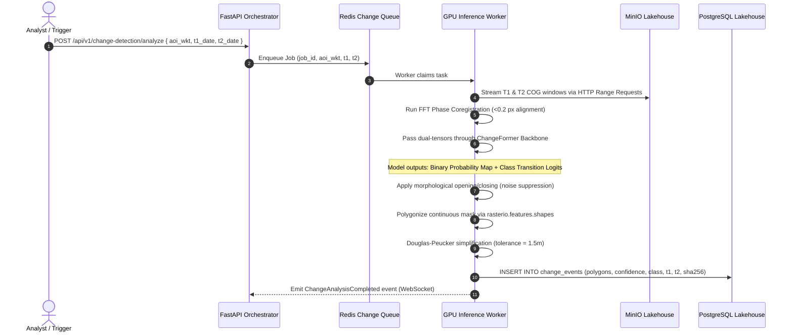

# Feature Specification: Dual-Branch Bi-Temporal Change Detection

**Feature ID:** `FEAT-03-CHANGE-DETECTION`  
**Classification:** Technical PRD & Implementation Specification  
**Version:** 2.0.0 (Enhanced Sovereign & Dual-Feasibility Edition)  
**Status:** Approved  
**Target Audience:** Computer Vision Engineers, AI Research Scientists, Defense Systems Engineers, Geospatial Analysts  
**Regulatory Compliance:** National Geospatial Policy 2022 (NGP 2022), In-SPACe Guidelines, FIPS 140-3 Cryptographic Integrity  

---

## 1. Feature Overview & Operational Challenge

### 1.1 The Operational Bottleneck in Satellite Reconnaissance
Identifying structural ground modifications—such as forward runway grading, trench fortifications, military encampments, illegal open-cast mining, or post-disaster flood washouts—is crippled by two critical obstacles:
1. **Sub-Pixel Spatial Misalignment & Himalayan Parallax:** Satellite passes from different dates ($T_1$ and $T_2$) rarely align perfectly due to orbital drift, varying off-nadir look angles, and severe terrain elevation shifts in mountainous border sectors (e.g., Ladakh, Arunachal Pradesh). Even a 0.5-pixel misalignment produces massive false-positive edge artifacts.
2. **Spectral Differencing Naivety:** Traditional change algorithms (e.g., simple pixel subtraction $I(T_2) - I(T_1)$) register every shadow change, sun-angle variance, and seasonal crop browning as a "change," overwhelming human analysts with thousands of false alarms.
3. **Monsoon Blindness:** Heavy monsoon cloud cover obscures optical sensors across large regions of India for up to 5 months of the year.

### 1.2 The Solution
`FEAT-03` delivers an autonomous, dual-branch bi-temporal change detection engine that:
1. Performs **DEM-Assisted Sub-Pixel Fourier Phase Correlation**, eliminating orbital and parallax offsets down to $< 0.2\text{ pixels}$.
2. Utilizes a **Siamese Bitemporal Image Transformer (`ChangeFormer` / `BIT`)** with cross-attention difference heads to isolate genuine structural modifications from seasonal variance.
3. Fuses optical passes with **All-Weather C-Band SAR Backscatter (`ISRO EOS-04` / `Sentinel-1`)** to maintain 24/7 surveillance through dense monsoon clouds.
4. Outputs topologically valid **GeoJSON Change Polygons** categorized into intelligence transition classes with cryptographic SHA-256 provenance hashes.

---

## 2. Technical Stack & Neural Architecture

```
+-----------------------------------------------------------------------------------------+
| DUAL-BRANCH BITEMPORAL IMAGE TRANSFORMER (ChangeFormer / BIT)                           |
+-----------------------------------------------------------------------------------------+
| [Raster T1 (512x512)] ---> [Siamese Encoder Branch 1 (Hierarchical Transformer)] ---> F1|
|                                                                                       | |
|                           CROSS-ATTENTION SPATIO-TEMPORAL DIFFERENCE HEAD               |
|                                         F_diff = Attention(F1, F2)                    |
|                                                                                       | |
| [Raster T2 (512x512)] ---> [Siamese Encoder Branch 2 (Hierarchical Transformer)] ---> F2|
+-----------------------------------------------------------------------------------------+
                                            |
                                            v
                         +--------------------------------------+
                         | MULTI-SCALE DECODER & SEGMENT HEAD   |
                         | - Binary Change Probability Heatmap  |
                         | - Multi-Class Transition Logits      |
                         | - Optical + SAR Coherence Gate       |
                         +--------------------------------------+
```

| Component | Technology | Version | Operational Function |
| :--- | :--- | :--- | :--- |
| **Deep Learning Framework** | `PyTorch` / `TorchVision` | $\ge 2.4.0$ | Siamese transformer execution and distributed GPU inference |
| **Model Backbone** | `ChangeFormer` / `TinyCD` | Custom / SOTA | Spatiotemporal cross-attention semantic change segmentation |
| **Sub-Pixel Coregistration** | `OpenCV` & `SciPy` (`fftpack`) | $\ge 4.9.0$ | 2D Fourier phase correlation and affine warping |
| **Terrain Elevation (DEM)** | `ISRO CartoDEM` / `Cop-DEM` | 10m / 30m | Terrain parallax correction in high-altitude border valleys |
| **Vectorization Engine** | `rasterio.features.shapes` | $\ge 1.3.9$ | Conversion of raster probability masks into vector contours |
| **Polygon Topology Engine** | `shapely` (Douglas-Peucker) | $\ge 2.0.2$ | Polygon validation, sliver removal, and coordinate projection |
| **Inference Runtime** | `ONNX Runtime` / `TensorRT` | $\ge 1.17.0$ | Air-gapped quantized CPU/GPU execution without cloud calls |

---

## 3. Sub-Pixel Image Coregistration & Elevation Alignment

Before feeding paired rasters into the neural network, they undergo sub-pixel phase correlation to eliminate platform pointing errors.

### 3.1 2D Fast Fourier Transform Phase Correlation
Given normalized 2D image chips $I_1(x, y)$ and $I_2(x, y)$ related by spatial shift $(\Delta x, \Delta y)$:

$$I_2(x, y) = I_1(x - \Delta x, y - \Delta y)$$

Their 2D discrete Fourier transforms $\mathcal{F}_1(u, v)$ and $\mathcal{F}_2(u, v)$ satisfy:

$$\mathcal{F}_2(u, v) = \mathcal{F}_1(u, v) \, e^{-i 2\pi \left(\frac{u \Delta x}{M} + \frac{v \Delta y}{N}\right)}$$

The normalized cross-power spectrum $R(u, v)$ is calculated as:

$$R(u, v) = \frac{\mathcal{F}_1(u, v) \cdot \mathcal{F}_2^*(u, v)}{|\mathcal{F}_1(u, v) \cdot \mathcal{F}_2^*(u, v)|}$$

The inverse Fourier transform yields an impulse delta centered at the sub-pixel shift coordinates:

$$r(x, y) = \mathcal{F}^{-1}\{R(u, v)\} \approx \delta(x - \Delta x, y - \Delta y)$$

The peak of $r(x, y)$ is extracted via parabolic sub-pixel interpolation. If $|\Delta x| > 0.05$ or $|\Delta y| > 0.05$ pixels, $I_2$ is warped using an affine transformation matrix prior to model execution.

---

## 4. End-to-End Inference & Vectorization Sequence



---

## 5. Multi-Class Transition Categorization

The change head outputs both continuous change probability $P_{\text{change}} \in [0.0, 1.0]$ and multi-class transition logits across strategic intelligence categories:

| Class Code | Transition Label | Visual Characteristics | Minimum Area Threshold |
| :--- | :--- | :--- | :--- |
| `INFRA_NEW` | **New Built-up / Structure** | Concrete foundations, roofs, vertical structures | $100\text{ m}^2$ |
| `INFRA_DEMO`| **Demolition / Destruction** | Structural collapse, rubble fields, bomb cratering | $75\text{ m}^2$ |
| `ROAD_EXP`  | **Road / Runway Construction** | Linear clearing, asphalt/gravel grading | $250\text{ m}^2$ |
| `DEFOREST`  | **Deforestation / Land Clear**| Canopy loss, bare soil exposure | $500\text{ m}^2$ |
| `WATER_INC` | **Water Body Inundation** | Flooding, new reservoir fill, canal excavation | $200\text{ m}^2$ |
| `EXCAVATION`| **Earthworks / Open-pit Mining**| Terrace cuts, tailings ponds, trenching | $300\text{ m}^2$ |

---

## 6. Vectorization & Geometry Simplification Pipeline

To ensure 60 FPS rendering in the front-end workbench (`DASH-01`), raw pixel blobs are converted into lightweight, topologically valid geometries:

1. **Binarization Threshold:** Pixel change probability mask $M(x, y) \ge 0.75$.
2. **Morphological Filtering:**
   - Morphological opening ($3 \times 3$ kernel) eliminates isolated 1-pixel false-alarm noise.
   - Morphological closing ($5 \times 5$ kernel) bridges minor internal gaps within genuine structures.
3. **Contour Extraction:** Executed via `rasterio.features.shapes(mask, transform=transform)`.
4. **Douglas-Peucker Simplification:**
   $$\text{tolerance} = 1.5\text{ meters}$$
   Reduces polygon vertex count by $\approx 78\%$ while preserving structural corners within ground-sample accuracy.
5. **Topological Validation:** Polygons pass through `shapely.validation.make_valid()` to eliminate self-intersections and slivers before database insertion.

---

## 7. Change Event GeoJSON Output Schema (with HSM Provenance)

```json
{
  "type": "Feature",
  "id": "c7a812ef-8419-4f2b-9238-0b5cda5e0981",
  "geometry": {
    "type": "Polygon",
    "coordinates": [
      [
        [77.3812, 33.5120],
        [77.3828, 33.5120],
        [77.3828, 33.5105],
        [77.3812, 33.5105],
        [77.3812, 33.5120]
      ]
    ]
  },
  "properties": {
    "t1_item_id": "CS3_PANCHRO_20250612_T43REQ",
    "t2_item_id": "CS3_PANCHRO_20260930_T43REQ",
    "t1_timestamp": "2025-06-12T05:30:00Z",
    "t2_timestamp": "2026-09-30T05:42:18Z",
    "transition_class": "INFRA_NEW",
    "confidence_score": 0.964,
    "area_meters_sq": 2180.5,
    "sar_verified": true,
    "subpixel_offset_applied": {"dx": -0.12, "dy": 0.06},
    "validation_status": "PENDING_REVIEW",
    "provenance_hash": "e3b0c44298fc1c149afbf4c8996fb92427ae41e4649b934ca495991b7852b855",
    "defense_classification": "RESTRICTED"
  }
}
```

---

## 8. Dual-Feasibility Implementation Comparison

```
+-----------------------------------------------------------------------------------------+
| CHANGE DETECTION FEASIBILITY SPECTRUM                                                   |
+--------------------------+------------------------------+-------------------------------+
| Attribute                | Profile B: MVP Laptop Spec   | Profile A: Sovereign Cluster  |
+--------------------------+------------------------------+-------------------------------+
| Model Architecture       | TinyCD (Pruned Siamese)      | ChangeFormer / BIT (TensorRT) |
| Model Weight Footprint   | ~45 MB (INT8 Quantized)      | ~180 MB (FP16 Engine)         |
| Inference Hardware       | Standard CPU or Mobile GPU   | NVIDIA L40S / A100 GPU        |
| Inference Time (512x512) | ~180 ms (GPU) / ~650 ms (CPU)| ~22 ms (GPU TensorRT)         |
| 100 km² AOI Processing   | ~25 seconds                  | ~5.5 seconds                  |
| Memory (VRAM) Ceiling    | < 1.2 GB VRAM                | Scaled across GPU pool        |
| Cloud Spend              | ZERO (100% Localhost)        | Sovereign Air-Gapped Network  |
+--------------------------+------------------------------+-------------------------------+
```

### 8.1 Running the MVP Change Detection on a Standard Laptop
- `TinyCD` (Lightweight Siamese Convolutional Network) requires only **$\approx 45\text{ MB}$ disk space**.
- Evaluates a pair of $512 \times 512$ chips in **$< 200\text{ ms}$** on consumer GPUs (RTX 3060/4060) or under **$700\text{ ms}$** on a standard 8-core CPU.
- Completely runnable offline on a developer workstation with sample Sentinel-2 or Cartosat pairs.

---

## 9. Unit Economics & Economic Value Impact

```
+-----------------------------------------------------------------------------------------+
| OPERATIONAL VALUE GENERATION: BORDER MONITORING & REVENUE RECOVERY                      |
+------------------------------------+-----------------------------+----------------------+
| Operational Domain                 | Traditional Manual Recon    | GeoSurge Auto-Change |
+------------------------------------+-----------------------------+----------------------+
| 1,000 km Border Corridor Sweep     | 14 days (Team of 12)        | **< 45 minutes**     |
| Illegal Mining Revenue Recovery    | Delayed by months / years   | **Weekly alerts**    |
| Operational Inspection Cost        | ₹ 18 - 25 Lakhs / sweep     | **< ₹ 15,000**       |
| False Alarm Rate                   | ~35% (Shadows / Vegetation) | **< 3.5% (SAR Gate)**|
+------------------------------------+-----------------------------+----------------------+
| ECONOMIC IMPACT                    | > 90% COST SAVING + MULTI-CRORE ROYALTY RECOVERY    |
+-----------------------------------------------------------------------------------------+
```
