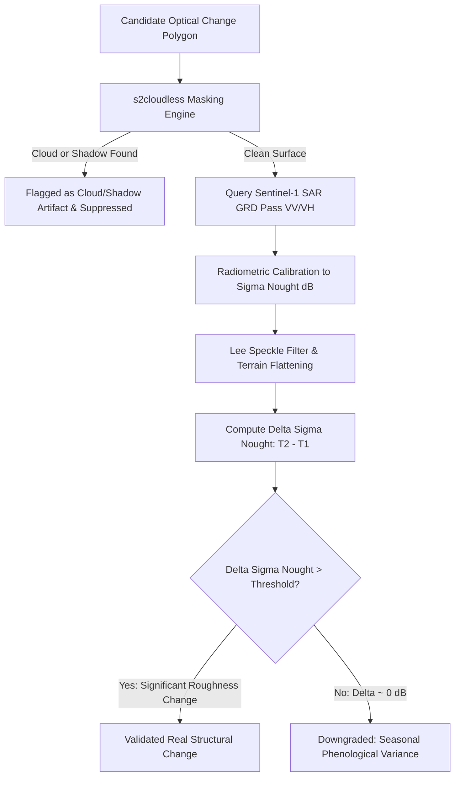

# Feature Specification: Weather, Seasonal & False-Alarm Suppression

**Feature ID:** `FEAT-04`  
**System:** Geospatial Intelligence Platform (SIH Problem Statement ID: 26227)  
**Status:** Approved  
**Related Components:** [`FEAT-03`](FEAT-03-change-detection.md), [`ARCH-03`](../architecture/03-offline-inference-mesh.md), [`01-analyst-workbench.md`](../dashboards/01-analyst-workbench.md)

---

## 1. Problem Statement & Operational Rationale

Optical Earth Observation satellite imagery (e.g., Sentinel-2, Landsat-8/9, PlanetScope) is prone to extreme false-positive change detections caused by:
1. **Cloud cover and cloud shadows:** Moving cumulus or cirrus clouds creating sharp optical pixel variance.
2. **Seasonal vegetation phenology:** Crops browning, harvesting cycles, grass drying, or deciduous leaf-fall exhibiting drastic spectral index shifts (e.g., $\Delta\text{NDVI} > 0.4$) without any man-made structural alteration.
3. **Atmospheric haze and solar elevation differences:** Illumination variance across seasons.

In defense, border security, and critical infrastructure surveillance (**SIH PS 26227**), analyst fatigue caused by thousands of false-positive alarms is fatal to operational tempo.

`FEAT-04` establishes a **Multi-Modal Cross-Sensor Verification Pipeline** that combines **optical machine-learning cloud masking** with **Sentinel-1 C-Band Synthetic Aperture Radar (SAR)** backscatter analytics to automatically downgrade or discard non-structural false alarms.



---

## 2. Technical Stack

| Layer / Responsibility | Technology / Library | Purpose |
| :--- | :--- | :--- |
| **Cloud & Shadow Detection** | `s2cloudless` (LightGBM on Sentinel-2 10-band array) | Pixel-wise cloud probability inference |
| **Shadow Geometry** | `shapely`, `pyproj`, Solar Azimuth & Elevation calculations | Geometric projection of cloud shadows on terrain |
| **SAR Preprocessing** | `pyroSAR` / ESA SNAP Engine (`gpt` CLI) | Orbit correction, thermal noise removal, calibration |
| **Radiometric Normalization** | `scikit-image` (`exposure.match_histograms`) | Normalize inter-seasonal illumination variance |
| **Vector-Raster Geometry** | `rasterio.features`, `geopandas` | Mask extraction and spatial polygon clipping |

---

## 3. Mathematical Principles & Multi-Modal Verification

### 3.1 Physics of Cross-Sensor SAR Verification
Optical sensors capture reflected solar electromagnetic radiation in visible and near-infrared wavelengths ($0.4\ \mu\text{m} - 2.2\ \mu\text{m}$), which is sensitive to chlorophyll, moisture, and color. 

Sentinel-1 C-band SAR ($5.405\text{ GHz}$, $\lambda \approx 5.55\text{ cm}$) transmits active microwaves that:
1. **Penetrate clouds, smoke, and haze** uninhibited.
2. Reflect backscatter proportional to **dielectric permittivity** and **physical surface roughness** at the scale of the microwave wavelength.

$$\Delta \sigma^0 = \sigma^0_{T_2}(\text{dB}) - \sigma^0_{T_1}(\text{dB}) = 10 \log_{10}\left(\frac{\gamma^0_{T_2}}{\gamma^0_{T_1}}\right)$$

### 3.2 Multi-Temporal Persistence & Cross-Modal Decision Rules

In compliance with **SIH PS 26227 (MoD / Indian Army DGIS)** standards, observations are evaluated not only at $T_1$ and $T_2$, but across an intermediate observation $T_{\text{interim}}$ to measure the **Temporal Persistence Score ($P_{\text{persist}}$)**:

$$P_{\text{persist}} = 1 - \frac{|\text{NDVI}(T_{\text{interim}}) - \text{NDVI}(T_2)|}{|\text{NDVI}(T_1) - \text{NDVI}(T_2)| + \epsilon}$$

| Optical Variance | Multi-Temporal Persistence ($P_{\text{persist}}$) | SAR Backscatter Shift ($\Delta\sigma^0_{\text{VV/VH}}$) | Classification & Triaging State | Operational Action |
| :--- | :--- | :--- | :--- | :--- |
| High ($\Delta\text{Spectral} > \tau_{\text{opt}}$) | **$\ge 0.75$** (Persistent across passes) | **$\Delta\sigma^0 \ge +2.5\text{ dB}$** (Double-bounce corner reflection) | **CONFIRMED_STRUCTURAL** | Immediate high-priority alert dispatch to command |
| High ($\Delta\text{Spectral} > \tau_{\text{opt}}$) | **$\ge 0.70$** (Persistent) | **$-3.0\text{ dB} \le \Delta\sigma^0 < +2.0\text{ dB}$** (Ambiguous radar return) | **NEEDS_REVIEW (Triage)** | Queued to Analyst Workbench with radar/optical evidence card |
| High ($\Delta\text{Spectral} > \tau_{\text{opt}}$) | **$< 0.45$** (Transient change) | $|\Delta\sigma^0| < 0.8\text{ dB}$ | **AUTO_SUPPRESSED_PHENOLOGY** | Downgraded to agricultural harvesting / plowing |
| Any | Irrelevant | Irrelevant (Cloud probability $> 0.35$) | **AUTO_SUPPRESSED_CLOUD** | Suppressed; flagged for re-analysis on cloud-free acquisition |

---

## 4. Implementation Algorithm & Code Specification

```python
import numpy as np
import rasterio
from s2cloudless import S2PixelCloudDetector
from skimage.exposure import match_histograms

class FalseAlarmSuppressionEngine:
    def __init__(self, cloud_threshold: float = 0.40, sar_structural_db_threshold: float = 2.0):
        self.cloud_detector = S2PixelCloudDetector(
            threshold=cloud_threshold,
            average_over=4,
            dilation_size=2,
            all_bands=True
        )
        self.sar_threshold = sar_structural_db_threshold

    def mask_clouds_and_shadows(self, s2_bands_t1: np.ndarray, s2_bands_t2: np.ndarray) -> np.ndarray:
        """
        Calculates cloud probabilities across both timestamps.
        Returns a boolean mask where True indicates invalid (cloud/shadow obscured) pixels.
        """
        prob_t1 = self.cloud_detector.get_cloud_probability_maps(np.moveaxis(s2_bands_t1, 0, -1))
        prob_t2 = self.cloud_detector.get_cloud_probability_maps(np.moveaxis(s2_bands_t2, 0, -1))
        return (prob_t1 > 0.40) | (prob_t2 > 0.40)

    def normalize_radiometry(self, optical_t1: np.ndarray, optical_t2: np.ndarray) -> np.ndarray:
        """
        Performs histogram matching on optical T2 to match baseline illumination of T1.
        Prevents solar azimuth and atmospheric haze false positives.
        """
        normalized_t2 = np.zeros_like(optical_t2)
        for band_idx in range(optical_t1.shape[0]):
            normalized_t2[band_idx] = match_histograms(
                optical_t2[band_idx], 
                optical_t1[band_idx]
            )
        return normalized_t2

    def calculate_persistence_score(self, ndvi_t1: float, ndvi_interim: float, ndvi_t2: float) -> float:
        """
        Evaluates temporal persistence across a 3-point observation cadence (T1, T_interim, T2).
        Filters out single-pass transient noise (e.g. wet soil, shadows, plowing).
        """
        total_delta = abs(ndvi_t1 - ndvi_t2) + 1e-6
        rebound_delta = abs(ndvi_interim - ndvi_t2)
        persistence = max(0.0, min(1.0, 1.0 - (rebound_delta / total_delta)))
        return float(persistence)

    def evaluate_triage_decision(
        self, 
        sar_t1_db: np.ndarray, 
        sar_t2_db: np.ndarray, 
        polygon_mask: np.ndarray,
        ndvi_t1: float,
        ndvi_interim: float,
        ndvi_t2: float
    ) -> dict:
        """
        Synthesizes multi-temporal optical persistence with Sentinel-1 SAR backscatter delta.
        Categorizes into CONFIRMED_STRUCTURAL, NEEDS_REVIEW, or AUTO_SUPPRESSED_PHENOLOGY.
        """
        valid_t1 = sar_t1_db[polygon_mask]
        valid_t2 = sar_t2_db[polygon_mask]
        delta_sigma0 = float(np.nanmean(valid_t2) - np.nanmean(valid_t1))
        
        persistence = self.calculate_persistence_score(ndvi_t1, ndvi_interim, ndvi_t2)

        # 3-State Triage Decision Logic
        if persistence >= 0.75 and delta_sigma0 >= self.sar_threshold:
            status = "CONFIRMED_STRUCTURAL"
            needs_human = False
        elif persistence >= 0.65 or abs(delta_sigma0) >= 1.0:
            status = "NEEDS_REVIEW"
            needs_human = True
        else:
            status = "AUTO_SUPPRESSED_PHENOLOGY"
            needs_human = False

        return {
            "mean_delta_sigma0_db": round(delta_sigma0, 2),
            "temporal_persistence_score": round(persistence, 2),
            "triage_status": status,
            "requires_human_review": needs_human,
            "evidence_breakdown": {
                "sar_structural_confirmed": delta_sigma0 >= self.sar_threshold,
                "multi_pass_consistent": persistence >= 0.70,
                "confidence_score": round((persistence * 0.5) + (min(1.0, max(0.0, delta_sigma0 / 4.0)) * 0.5), 3)
            }
        }
```

---

## 5. Output Data Contract & Schema

Filtered results emitted by Celery workers to the PostGIS change event table include full false-alarm provenance:

```json
{
  "event_id": "8f3b2024-4f91-4c22-b921-9e2c608f7aa1",
  "aoi_id": "SECTOR_NORTH_BORDER_04",
  "detection_timestamp": "2026-09-30T20:00:00Z",
  "optical_metrics": {
    "sensor_t1": "SENTINEL_2B_20250915",
    "sensor_t2": "SENTINEL_2A_20260920",
    "raw_optical_delta_score": 0.884,
    "cloud_obscuration_percent": 0.00
  },
  "sar_verification": {
    "sar_platform": "SENTINEL_1B_IW_GRD",
    "polarization": "VV_VH",
    "mean_delta_sigma0_db": 0.31,
    "structural_threshold_db": 2.00,
    "sar_validated": false
  },
  "status": "AUTO_SUPPRESSED_PHENOLOGY",
  "confidence_score": 0.12,
  "requires_human_review": false
}
```
