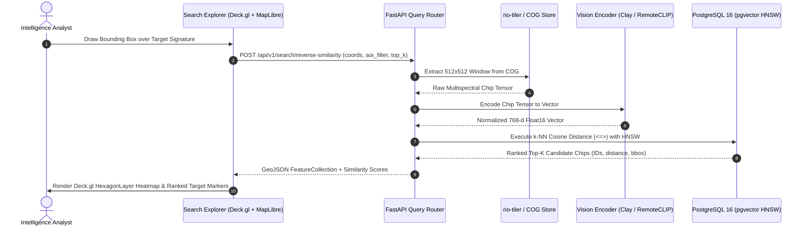

# Feature Specification: Reverse Similarity Search (Visual Geo-Intelligence)

**Feature ID:** `FEAT-05`  
**System:** Geospatial Intelligence Platform (SIH Problem Statement ID: 26227)  
**Status:** Approved  
**Related Components:** [`FEAT-02`](FEAT-02-semantic-retrieval.md), [`ARCH-03`](../architecture/03-offline-inference-mesh.md), [`02-intelligence-search.md`](../dashboards/02-intelligence-search.md)

---

## 1. Problem Statement & Operational Rationale

In strategic defense and earth observation missions (**SIH PS 26227**), once an analyst identifies a critical target of interest—such as an unmapped clandestine airstrip, surface-to-air missile (SAM) revetment, illegal mining excavation, or fortified border outpost—there is an immediate requirement to find **all identical or structurally similar installations** across thousands of square kilometers of satellite archives.

Manual visual scanning of millions of square kilometers is humanly impossible and operationally unviable. 

`FEAT-05` provides an automated **Reverse Visual Geo-Intelligence Search** engine. An analyst simply draws a bounding box on the map or uploads an imagery crop. The system extracts the multi-spectral visual signature, queries a high-dimensional vector index (`pgvector` HNSW) over millions of pre-indexed H3 spatial chips, and renders ranked visual matches and geospatial cluster heatmaps in sub-second response times.



---

## 2. Technical Stack

| Layer | Technology | Function |
| :--- | :--- | :--- |
| **Window Extraction** | `rio-tiler` + `rasterio` | Zero-copy windowed HTTP range-request reads from Cloud-Optimized GeoTIFFs in MinIO |
| **Vision Backbone** | Clay Foundation Model v1.5 / RemoteCLIP (ViT-B/32) | Generates L2-normalized 768-dimensional invariant spatial feature vectors |
| **Vector Indexing & Storage** | PostgreSQL 16 + `pgvector` with HNSW | Sub-linear $k$-NN approximate nearest neighbor retrieval |
| **Spatial Indexing** | Uber H3-py (Resolution 8 & 9) | Discrete Global Grid tessellation for chip spatial partitioning |
| **Client Visualization** | Deck.gl `HexagonLayer` & `ScatterplotLayer` | GPU-accelerated spatial density clustering of similar candidates |

---

## 3. Mathematical Retrieval Formulation

Let the reference visual crop extracted from the analyst's selected window be tensor $X_{\text{ref}} \in \mathbb{R}^{C \times H \times W}$.

The foundation vision backbone $f_\theta$ transforms $X_{\text{ref}}$ into a high-dimensional feature embedding $\mathbf{v}_{\text{ref}} \in \mathbb{R}^{768}$, normalized onto the unit hypersphere:

$$\mathbf{v}_{\text{ref}} = \frac{f_\theta(X_{\text{ref}})}{\|f_\theta(X_{\text{ref}})\|_2}$$

For every indexed satellite chip $i$ with stored unit embedding $\mathbf{u}_i \in \mathbb{R}^{768}$, the similarity is computed via **Cosine Distance**:

$$D_{\cos}(\mathbf{v}_{\text{ref}}, \mathbf{u}_i) = 1 - \langle \mathbf{v}_{\text{ref}}, \mathbf{u}_i \rangle = 1 - \sum_{k=1}^{768} v_{\text{ref}, k} \cdot u_{i, k}$$

The retrieval problem finds the set of $K$ indices minimizing this distance subject to optional spatial-temporal predicates:

$$\mathcal{K}^* = \arg\min_{i \in \mathcal{S}_{\text{AOI}}}^{(K)} D_{\cos}(\mathbf{v}_{\text{ref}}, \mathbf{u}_i)$$

---

## 4. Implementation Details

### 4.1 Window Extraction and Encoding Router (FastAPI)

```python
from fastapi import APIRouter, HTTPException, Depends
from pydantic import BaseModel, Field
from typing import List, Optional
import numpy as np
from rio_tiler.io import COGReader
import torch

router = APIRouter(prefix="/api/v1/search", tags=["Semantic & Visual Search"])

class ReverseSearchRequest(BaseModel):
    cog_asset_id: str
    bounding_box: List[float] = Field(..., description="[min_lon, min_lat, max_lon, max_lat]")
    regional_polygon_wkt: Optional[str] = None
    similarity_threshold: float = Field(0.75, ge=0.0, le=1.0)
    limit: int = Field(50, ge=1, le=500)

@router.post("/reverse-similarity")
async def reverse_similarity_search(req: ReverseSearchRequest):
    # 1. Read directly from COG via rio-tiler without downloading entire scene
    try:
        with COGReader(f"s3://satellite-cogs/{req.cog_asset_id}.tif") as cog:
            img = cog.part(req.bounding_box, bounds_crs="epsg:4326", width=512, height=512)
            chip_tensor = torch.from_numpy(img.data).float().unsqueeze(0)
    except Exception as e:
        raise HTTPException(status_code=400, detail=f"Failed to extract COG window: {str(e)}")

    # 2. Extract normalized embedding vector from vision encoder
    query_vector = vision_model.encode_image(chip_tensor) # Shape: (1, 768)
    vector_list = query_vector.squeeze().tolist()

    # 3. Execute hybrid spatial + vector SQL query
    results = await db_pool.fetch(
        """
        SET LOCAL hnsw.ef_search = 64;
        SELECT 
            chip_id,
            h3_index,
            capture_date,
            ST_AsGeoJSON(footprint)::json AS geometry,
            thumbnail_url,
            1 - (embedding <=> $1::vector) AS cosine_similarity
        FROM satellite_chips
        WHERE 1 - (embedding <=> $1::vector) >= $2
          AND ($3::geometry IS NULL OR ST_Intersects(footprint, ST_GeomFromText($3, 4326)))
        ORDER BY embedding <=> $1::vector ASC
        LIMIT $4;
        """,
        vector_list,
        req.similarity_threshold,
        req.regional_polygon_wkt,
        req.limit
    )

    return {
        "query_reference_bbox": req.bounding_box,
        "match_count": len(results),
        "matches": [dict(r) for r in results]
    }
```

### 4.2 Database Table & HNSW Index Definition

```sql
CREATE EXTENSION IF NOT EXISTS vector;
CREATE EXTENSION IF NOT EXISTS postgis;

CREATE TABLE satellite_chips (
    chip_id UUID PRIMARY KEY DEFAULT gen_random_uuid(),
    cog_parent_id UUID NOT NULL,
    h3_index VARCHAR(15) NOT NULL,
    capture_date DATE NOT NULL,
    footprint GEOMETRY(Polygon, 4326) NOT NULL,
    thumbnail_url VARCHAR(512) NOT NULL,
    embedding halfvec(768) NOT NULL,
    spectral_indices JSONB NOT NULL,     -- Stores mean NDVI, NDBI, NDWI per chip
    created_at TIMESTAMP WITH TIME ZONE DEFAULT CURRENT_TIMESTAMP
);

-- Spatial index for bounding box filtering
CREATE INDEX idx_satellite_chips_footprint ON satellite_chips USING GIST (footprint);
CREATE INDEX idx_satellite_chips_h3 ON satellite_chips (h3_index);

-- Production Halfvec HNSW Index optimized for Cosine Distance (<=>)
CREATE INDEX idx_satellite_chips_embedding_hnsw 
ON satellite_chips 
USING hnsw (embedding halfvec_cosine_ops)
WITH (m = 16, ef_construction = 64);
```

---

## 5. UI Presentation & Density Heatmap

Results delivered to the frontend [Semantic Intelligence Search Explorer](../dashboards/02-intelligence-search.md) are rendered simultaneously in two coordinated layers:

1. **Deck.gl `HexagonLayer`:** Visualizes the geographic distribution and density clustering of matching signatures across state/regional scales, instantly identifying proliferation hotspots.
2. **Interactive Result Drawer:** Displays side-by-side chips with cosine similarity confidence percentages ($92.4\%$, $87.1\%$), sensor metadata, and one-click coordinate jump controls.
