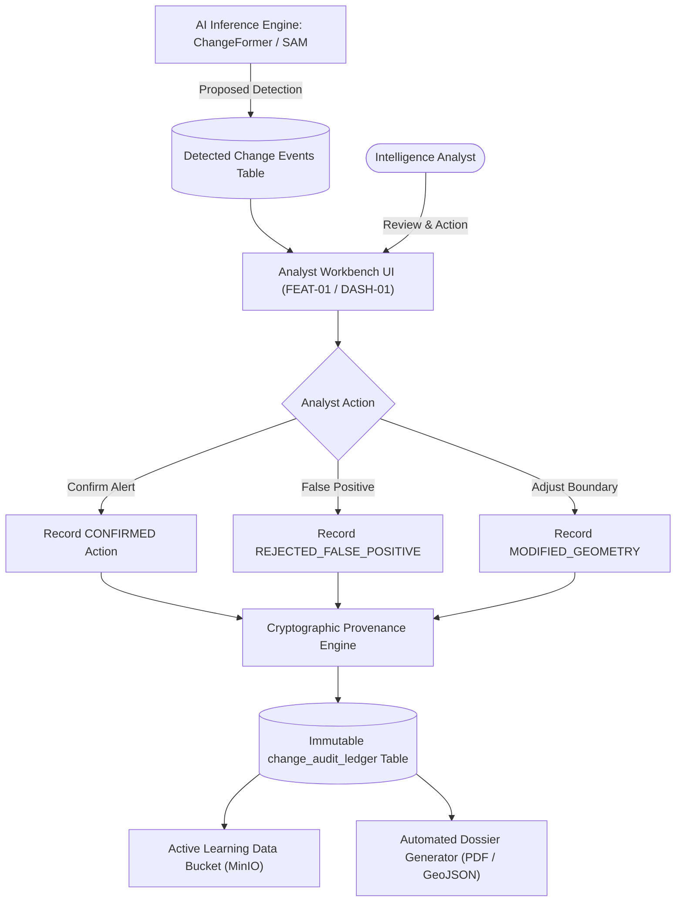

# Feature Specification: Human-in-the-Loop Validation & Provenance Logging

**Feature ID:** `FEAT-06`  
**System:** Geospatial Intelligence Platform (SIH Problem Statement ID: 26227)  
**Status:** Approved  
**Related Components:** [`ARCH-04`](../architecture/04-security-and-audit.md), [`FEAT-03`](FEAT-03-change-detection.md), [`01-analyst-workbench.md`](../dashboards/01-analyst-workbench.md), [`04-audit-and-export.md`](../dashboards/04-audit-and-export.md)

---

## 1. Problem Statement & Operational Rationale

Automated computer vision and AI models applied to Earth Observation data cannot be treated as infallible in mission-critical defense, border surveillance, and strategic infrastructure domains (**SIH PS 26227**). Decisions derived from satellite change alerts often drive military mobilization, diplomatic actions, or major infrastructure remediation.

`FEAT-06` establishes a comprehensive **Human-in-the-Loop (HITL)** architecture:
1. **Analyst Review Gate:** Ensures no change detection event transitions to an operational intelligence alert without human analyst verification, geometric modification, or rejection.
2. **Immutable Audit Ledger:** Every analyst touchpoint is recorded with cryptographic provenance, model weights versioning, and client telemetry.
3. **Active Learning Data Loop:** Validated decisions and rejected false-positives are curated into stratified datasets to iteratively fine-tune local models offline.
4. **Automated Intelligence Dossier Exporter:** 1-click generation of legally admissible, multi-page intelligence dossiers with imagery, coordinate footprints, and digital signatures.



---

## 2. Technical Stack

| Layer | Technology | Purpose |
| :--- | :--- | :--- |
| **Data Contracts & Validation** | Pydantic v2 | Strict schema validation, JSON schema generation, and payload sanitization |
| **ORM & Database Layer** | SQLAlchemy 2.0 (AsyncIO) + asyncpg | PostgreSQL transaction management with JSONB provenance payloads |
| **Report & Dossier Engine** | ReportLab / WeasyPrint (HTML+CSS to PDF) | Multi-page PDF generation with vector maps, chips, and metadata tables |
| **Vector Geometry Handling** | `shapely.geometry`, GeoJSON | Sub-pixel polygon editing, vertex simplification, and topological validation |
| **Data Export Formats** | `geopandas`, `fiona` | ESRI Shapefiles, GeoJSON, KML, and orthorectified GeoTIFF cutouts |

---

## 3. Data Contracts & Domain Models (Pydantic v2)

```python
from enum import Enum
from typing import Optional, Dict, Any, List
from pydantic import BaseModel, Field, UUID4
from datetime import datetime

class AnalystActionType(str, Enum):
    CONFIRMED = "CONFIRMED"
    REJECTED_FALSE_POSITIVE = "REJECTED_FALSE_POSITIVE"
    MODIFIED_GEOMETRY = "MODIFIED_GEOMETRY"
    NEEDS_REVIEW_ESCALATED = "NEEDS_REVIEW_ESCALATED"
    DEFERRED_FOR_SECOND_OPINION = "DEFERRED_FOR_SECOND_OPINION"

class JustificationCategory(str, Enum):
    GENUINE_CONSTRUCTION = "GENUINE_CONSTRUCTION"
    RUNWAY_EXPANSION = "RUNWAY_EXPANSION"
    FORTIFICATION_OR_BUNKER = "FORTIFICATION_OR_BUNKER"
    ROAD_EXPANSION = "ROAD_EXPANSION"
    EXCAVATION_OR_MINING = "EXCAVATION_OR_MINING"
    PHENOLOGY_AGRICULTURAL = "PHENOLOGY_AGRICULTURAL"
    CLOUD_SHADOW_ARTIFACT = "CLOUD_SHADOW_ARTIFACT"
    SENSOR_MISREGISTRATION = "SENSOR_MISREGISTRATION"
    OTHER = "OTHER"

class SensorAcquisitionProvenance(BaseModel):
    platform: str = Field(..., description="e.g. SENTINEL_2A, CARTOSAT_3, RISAT_1A, LANDSAT_9")
    acquisition_timestamp: datetime
    gsd_meters: float = Field(..., description="Ground Sampling Distance in meters")
    sun_azimuth_deg: float
    sun_elevation_deg: float
    incidence_angle_deg: Optional[float] = None
    cloud_cover_percent: float
    processing_level: str = Field("L2A_BOA", description="Bottom-of-Atmosphere surface reflectance")

class CrossModalEvidenceScorecard(BaseModel):
    fast_similarity_score: float = Field(..., ge=0.0, le=1.0)
    balanced_persistence_score: float = Field(..., ge=0.0, le=1.0)
    sar_delta_sigma0_db: float
    optical_ndbi_delta: float
    composite_confidence: float = Field(..., ge=0.0, le=1.0)
    triage_tier: str = Field(..., description="URGENT_CONFIRMED, NEEDS_REVIEW, or AUTO_SUPPRESSED")

class ReviewSubmissionRequest(BaseModel):
    event_id: UUID4
    analyst_action: AnalystActionType
    justification_code: JustificationCategory
    confidence_at_review: float = Field(..., ge=0.0, le=1.0)
    analyst_notes: Optional[str] = Field(None, max_length=2000)
    modified_geojson: Optional[Dict[str, Any]] = None  # Valid GeoJSON Polygon if modified

class EventProvenanceRecord(BaseModel):
    entry_id: UUID4
    event_id: UUID4
    sequence_num: int
    analyst_id: UUID4
    analyst_action: AnalystActionType
    previous_hash: str
    current_hash: str
    sensor_t1: SensorAcquisitionProvenance
    sensor_t2: SensorAcquisitionProvenance
    evidence_scorecard: CrossModalEvidenceScorecard
    model_metadata: Dict[str, Any]
    created_at: datetime
```

---

## 4. Active Learning Data Curation

Every human intervention generates high-value training signals:

1. **Rejection Harvest (Hard Negative Mining):** When an analyst tags an AI detection as `REJECTED_FALSE_POSITIVE` due to agricultural harvesting or shadow distortion, the $T_1/T_2$ chip pair is exported to the `active-learning/hard-negatives/` dataset to penalize false alarms in the next retraining epoch.
2. **Refined Geometry (Supervised Ground Truth):** When an analyst modifies polygon boundaries using the vertex editor, the modified geometry replaces the coarse AI segmentation mask in `active-learning/ground-truth/`, improving SAM-geospatial edge precision.

```python
# Active learning auto-export pipeline
async def export_to_active_learning_bucket(event_id: str, action: str, geojson_geom: dict, s3_client):
    target_prefix = "hard-negatives" if "REJECTED" in action else "refined-ground-truth"
    payload = {
        "event_id": event_id,
        "action": action,
        "geometry": geojson_geom,
        "exported_at": datetime.utcnow().isoformat()
    }
    await s3_client.put_object(
        Bucket="active-learning-curation",
        Key=f"{target_prefix}/{event_id}.json",
        Body=json.dumps(payload)
    )
```

---

## 5. Automated Intelligence Dossier Generation

The platform provides a one-click PDF export endpoint utilizing **WeasyPrint** / **ReportLab** to compile operational intelligence packages for field commands.

### Dossier Contents:
1. **Header & Classification Banner:** Document ID, classification banner (`SECRET / NOFORN`), dissemination controls.
2. **Geospatial Situation Overview:** Context overview map (1:50,000 scale) with centered target location.
3. **Multi-Temporal Split Panels:** Side-by-side $512\times 512$ optical crops of Date $T_1$ and Date $T_2$, plus the overlaid vector change polygon.
4. **Verification Evidence Matrix:**
   - Optical model confidence score vs. analyst review score.
   - Sentinel-1 SAR backscatter delta ($\Delta\sigma^0$) cross-sensor reading.
   - Cloud obscuration probability metrics.
5. **Chain of Custody & Sign-Off:** Digital signature block, analyst identity, timestamp authority stamp, and audit entry hash.

```
+-----------------------------------------------------------------------------------+
| CLASSIFICATION: CONFIDENTIAL // REL TO DEFENSE FORCES                            |
| GEOSPATIAL INTELLIGENCE VERIFICATION DOSSIER: GEOINT-2026-0930-01                 |
+-----------------------------------------------------------------------------------+
| Target AOI: NORTH_SECTOR_GRID_44B   | Coordinates: 34.1204 N, 74.8912 E           |
| Event ID: e92b...                   | Primary Classification: RUNWAY EXPANSION    |
+-----------------------------------------------------------------------------------+
|  [ Date T1: 2025-08-10 ]          [ Date T2: 2026-09-15 ]     [ Vector Overlay ]  |
|  Optical Baseline Sensor         Optical Follow-up           Confirmed Footprint  |
+-----------------------------------------------------------------------------------+
| Radiometric Delta: High (NDVI -0.42) | SAR Delta Sigma0: +3.82 dB (Confirmed)    |
| Reviewing Officer: Capt. R. Sharma   | Review Decision: CONFIRMED_GENUINE         |
| Ledger Block Hash: 9f8a4...71b       | Timestamp: 2026-09-30 20:15:00 UTC         |
+-----------------------------------------------------------------------------------+
```
