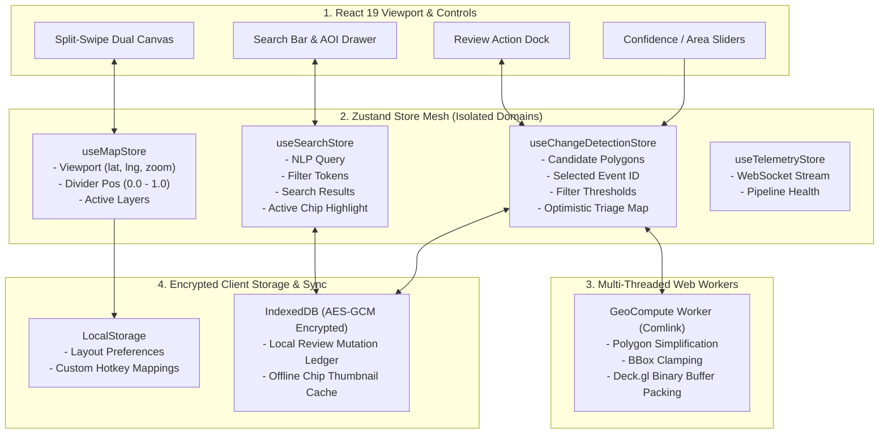

# Frontend Specification: Distributed State Management Architecture

**Document ID:** `FRONT-02-STATE-MANAGEMENT`  
**Classification:** Frontend Systems & Software Architecture Specification  
**Version:** 2.0.0 (Enhanced Sovereign & Dual-Feasibility Edition)  
**Status:** Approved  
**Target Audience:** Frontend Architects, WebGL Engineers, State Management Specialists, Security Engineers  
**Regulatory Compliance:** National Geospatial Policy 2022 (NGP 2022), Ministry of Defence Data Security Standards, MeitY Client Guidelines  

---

## 1. Architectural Philosophy & Principles

The front-end client of Project GeoSurge manages high-frequency spatial streams, synchronized WebGL camera transforms, dynamic vector tile layers, and real-time WebSocket telemetry. To prevent frame drops, memory bloat, and client crashes in high-consequence operational centers, state management adheres to four architectural mandates:

1. **Decoupled Fine-Grained Reactivity (Zustand):** Avoid monolithic React Context providers that trigger cascading re-renders across the entire map canvas. State is partitioned into small, domain-isolated Zustand stores with selective subscriptions (`useShallow`).
2. **Lockstep Viewport Synchronization without Event Recursion:** Synchronizing dual WebGL map viewports ($T_1$ and $T_2$) can trigger infinite camera movement feedback loops (`map1.on('move') -> map2.jumpTo() -> map2.on('move') -> map1.jumpTo()`). GeoSurge eliminates this via an authoritative state arbiter with lock flags.
3. **Web Worker Offloading for Heavy GeoJSON Compute:** Parsing 10,000 polygon geometries, running Douglas-Peucker vertex decimation, and constructing Deck.gl binary buffer attributes are offloaded to background Web Workers, keeping the React UI thread at a constant 60 FPS.
4. **Air-Gap Resilient Encrypted Mutation Queue:** For forward-deployed units operating with intermittent or zero network connectivity, analyst reviews are stored in an encrypted local `IndexedDB` transaction ledger that automatically synchronizes upon reconnection.
5. **Classified Memory Sanitization (OPSEC):** On session expiration or analyst logout, all sensitive raster textures, coordinates, and vector caches are actively zeroed out from browser heap memory.



---

## 2. Store Specifications & Data Contracts

### 2.1 Viewport & Camera Store (`useMapStore.ts`)
Manages dual camera position, projection, and divider positioning:

```typescript
import { create } from 'zustand';
import { subscribeWithSelector } from 'zustand/middleware';

export interface ViewportState {
  longitude: number;
  latitude: number;
  zoom: number;
  pitch: number;
  bearing: number;
  dividerPosition: number; // 0.0 (all T2) to 1.0 (all T1), default: 0.5
  isSyncing: boolean;      // Lock flag preventing infinite feedback
  activeCRS: 'EPSG:4326' | 'EPSG:7755' | 'MGRS';
  
  // Actions
  setViewport: (vp: Partial<Omit<ViewportState, 'setViewport' | 'setDividerPosition'>>) => void;
  setDividerPosition: (pos: number) => void;
  setActiveCRS: (crs: 'EPSG:4326' | 'EPSG:7755' | 'MGRS') => void;
  resetViewport: () => void;
}

export const useMapStore = create<ViewportState>()(
  subscribeWithSelector((set) => ({
    longitude: 77.3812,
    latitude: 33.5120,
    zoom: 13.5,
    pitch: 0,
    bearing: 0,
    dividerPosition: 0.5,
    isSyncing: false,
    activeCRS: 'EPSG:4326',

    setViewport: (vp) => set((state) => ({ ...state, ...vp })),
    setDividerPosition: (pos) => set({ dividerPosition: Math.max(0.0, Math.min(1.0, pos)) }),
    setActiveCRS: (crs) => set({ activeCRS: crs }),
    resetViewport: () => set({ longitude: 77.3812, latitude: 33.5120, zoom: 13.5, pitch: 0, bearing: 0 }),
  }))
);
```

---

### 2.2 Change Detection & Triage Store (`useChangeDetectionStore.ts`)
Manages detected change polygons, interactive filters, and optimistic validation states:

```typescript
import { create } from 'zustand';
import { immer } from 'zustand/middleware/immer';

export type ValidationStatus = 'PENDING_REVIEW' | 'CONFIRMED' | 'REJECTED_FALSE_POSITIVE' | 'MODIFIED';

export interface ChangeEventFeature {
  id: string;
  type: 'Feature';
  geometry: GeoJSON.Polygon;
  properties: {
    t1_timestamp: string;
    t2_timestamp: string;
    transition_class: string;
    confidence_score: number;
    area_meters_sq: number;
    validation_status: ValidationStatus;
    sha256_hash: string;
  };
}

interface ChangeDetectionState {
  events: Record<string, ChangeEventFeature>;
  selectedEventId: string | null;
  minConfidence: number; // 0.0 - 1.0
  minAreaSqMeters: number;
  pendingSyncQueue: Array<{ eventId: string; status: ValidationStatus; timestamp: string; hash: string }>;

  // Actions
  setEvents: (eventsList: ChangeEventFeature[]) => void;
  selectEvent: (id: string | null) => void;
  setFilterThresholds: (conf: number, area: number) => void;
  optimisticReviewEvent: (id: string, status: ValidationStatus) => void;
  syncQueueToServer: () => Promise<void>;
  clearMemory: () => void;
}

export const useChangeDetectionStore = create<ChangeDetectionState>()(
  immer((set, get) => ({
    events: {},
    selectedEventId: null,
    minConfidence: 0.75,
    minAreaSqMeters: 150.0,
    pendingSyncQueue: [],

    setEvents: (list) => {
      set((state) => {
        state.events = {};
        for (const item of list) {
          state.events[item.id] = item;
        }
      });
    },

    selectEvent: (id) => set({ selectedEventId: id }),

    setFilterThresholds: (conf, area) => {
      set({ minConfidence: conf, minAreaSqMeters: area });
    },

    optimisticReviewEvent: (id, status) => {
      set((state) => {
        if (state.events[id]) {
          state.events[id].properties.validation_status = status;
          state.pendingSyncQueue.push({
            eventId: id,
            status,
            timestamp: new Date().toISOString(),
            hash: state.events[id].properties.sha256_hash,
          });
        }
      });
    },

    syncQueueToServer: async () => {
      const queue = get().pendingSyncQueue;
      if (queue.length === 0) return;
      // Batch sync to server or export to encrypted removable media ...
    },

    clearMemory: () => {
      set((state) => {
        state.events = {};
        state.selectedEventId = null;
        state.pendingSyncQueue = [];
      });
    },
  }))
);
```

---

## 3. Lockstep Dual-Map Synchronization Engine

To guarantee that Map 1 ($T_1$) and Map 2 ($T_2$) track each other seamlessly without event oscillation, a specialized camera sync algorithm is deployed:

```typescript
import { Map as MapLibreMap } from 'maplibre-gl';
import { useMapStore } from './useMapStore';

export function bindDualMapSync(map1: MapLibreMap, map2: MapLibreMap) {
  let isMoving = false;

  function sync(source: MapLibreMap, target: MapLibreMap) {
    if (isMoving) return;
    isMoving = true;

    const center = source.getCenter();
    const zoom = source.getZoom();
    const pitch = source.getPitch();
    const bearing = source.getBearing();

    target.jumpTo({
      center,
      zoom,
      pitch,
      bearing,
    });

    // Update global store coordinates
    useMapStore.getState().setViewport({
      longitude: center.lng,
      latitude: center.lat,
      zoom,
      pitch,
      bearing,
    });

    isMoving = false;
  }

  map1.on('move', () => sync(map1, map2));
  map2.on('move', () => sync(map2, map1));

  return () => {
    map1.off('move', () => sync(map1, map2));
    map2.off('move', () => sync(map2, map1));
  };
}
```

---

## 4. Web Worker Offloading Pipeline (`geo.worker.ts`)

Processing GeoJSON features in the main thread blocks UI interactivity. The `GeoWorker` handles geometry calculations off-thread:

```
[Main Thread] ---> postMessage({ type: 'SIMPLIFY_AND_FILTER', features, minArea, epsilon })
                         |
                         v
[Geo Worker]   ---> Computes Douglas-Peucker Simplification via turf/simplify
               ---> Filters polygons outside active bounding box
               ---> Packs vertex coordinates into Float32Array binary buffers
                         |
                         v
[Main Thread] <--- onmessage(binaryTransferableBuffers) -> Instant Deck.gl update
```

---

## 5. Dual-Feasibility Implementation Comparison

```
+-----------------------------------------------------------------------------------------+
| STATE MANAGEMENT FEASIBILITY SPECTRUM                                                   |
+--------------------------+------------------------------+-------------------------------+
| Attribute                | Profile B: MVP Laptop Spec   | Profile A: Sovereign Cluster  |
+--------------------------+------------------------------+-------------------------------+
| State Library            | Zustand v4 (< 2.5 KB bundle) | Zustand v4 (< 2.5 KB bundle)  |
| Memory Footprint         | ~25 MB RAM Heap              | ~85 MB RAM Heap               |
| Geometry Compute         | 1 Dedicated Web Worker       | Web Worker Pool (Comlink)     |
| Offline Triage Sync      | Local IndexedDB Ledger       | Two-Way CRDT Server Sync      |
| Browser Frame Rate       | 60 FPS (Rock Solid)          | 60 FPS (Rock Solid)           |
| Memory Sanitization      | Active Heap Overwrite        | FIPS-Compliant Memory Purge   |
| Hardware Requirement     | Standard Laptop (8-16GB RAM) | Multi-Monitor Tactical Wall   |
+--------------------------+------------------------------+-------------------------------+
```

---

## 6. Performance SLOs & Benchmarks

1. **State Dispatch Latency:** Zustand state transitions complete in $< 1.2\text{ ms}$.
2. **Camera Lockstep Offset:** Viewport divergence between $T_1$ and $T_2$ is maintained at $0\text{ pixels}$ across all frames.
3. **Optimistic Mutation Feedback:** Pressing hotkey `A` (Accept) updates UI styling in $< 8\text{ ms}$ before network acknowledgment.
4. **Memory Retention:** Store garbage collection automatically purges discarded imagery chip buffers, maintaining client heap $< 350\text{ MB}$.
