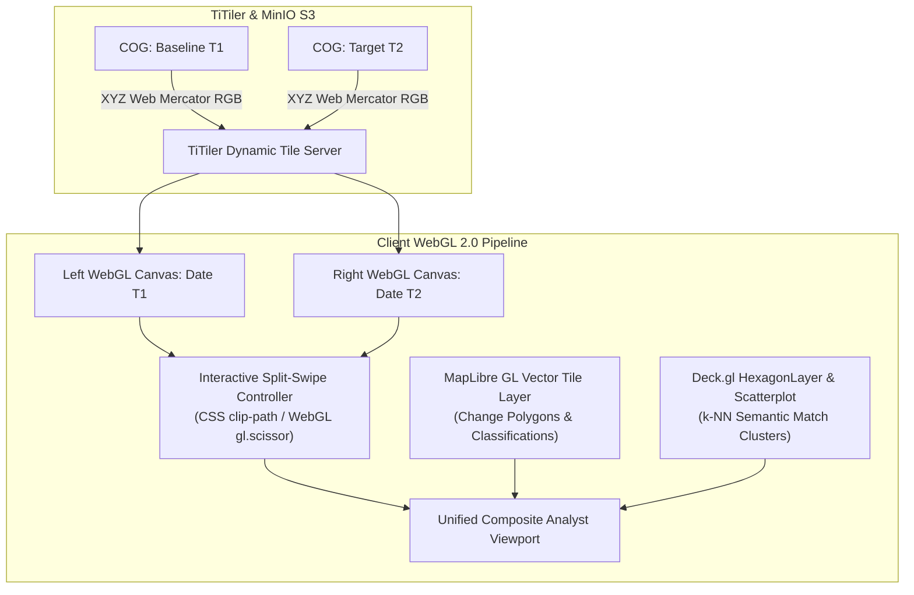

# Frontend Specification: WebGL & MapLibre / Deck.gl Rendering Pipeline

**Document ID:** `FRONT-03`  
**System:** Geospatial Intelligence Platform (SIH Problem Statement ID: 26227)  
**Status:** Approved  
**Related Components:** [`01-analyst-workbench.md`](../dashboards/01-analyst-workbench.md), [`02-intelligence-search.md`](../dashboards/02-intelligence-search.md), [`02-state-management.md`](02-state-management.md)

---

## 1. WebGL Architecture & Rendering Strategy

Displaying high-resolution multi-spectral satellite imagery alongside millions of high-dimensional vector search markers and thousands of complex change polygons at $60\text{ fps}$ requires a custom **WebGL 2.0 dual-canvas pipeline**.

In compliance with **SIH PS 26227**, the visualization stack integrates:
1. **MapLibre GL JS:** For tile pyramid orchestration, vector tile parsing (MVT), and sub-pixel vector geometry manipulation.
2. **Deck.gl v9:** For high-throughput GPU instanced rendering of country-scale point clusters, discrete global grid (H3) hexagonal overlays, and heatmaps.
3. **TiTiler Dynamic Tile Proxy:** Streaming Cloud-Optimized GeoTIFF (COG) byte arrays directly from MinIO into WebGL textures without pre-rendering static tile caches.



---

## 2. Split-Swipe Dual Viewport Implementation

To provide earth observation analysts with instant visual verification, the UI implements a **Split-Swipe Dual Viewport**.

### 2.1 Synchronization Mechanism
Two MapLibre map instances are mounted in parallel. Camera movements (`move`, `zoom`, `pitch`, `rotate`) on either canvas trigger a synchronized update across both viewports using a zero-overhead broadcast listener:

```typescript
// Camera lock synchronization
function synchronizeViewports(mapT1: maplibregl.Map, mapT2: maplibregl.Map) {
  let isSyncing = false;

  const sync = (source: maplibregl.Map, target: maplibregl.Map) => {
    if (isSyncing) return;
    isSyncing = true;
    target.jumpTo({
      center: source.getCenter(),
      zoom: source.getZoom(),
      bearing: source.getBearing(),
      pitch: source.getPitch(),
    });
    isSyncing = false;
  };

  mapT1.on('move', () => sync(mapT1, mapT2));
  mapT2.on('move', () => sync(mapT2, mapT1));
}
```

### 2.2 Scissor Clipping vs CSS Clip-Path
For maximum rendering efficiency without creating WebGL pipeline stalls:
- The base imagery layers use hardware-accelerated CSS `clip-path: inset(0 0 0 ${swipePercentage}%)` on the top container.
- This delegates the clipping mask directly to the GPU compositor thread without forcing a WebGL re-draw cycle on every pointer interaction.

---

## 3. Dynamic Vector Overlays & Real-Time Filtering

Detected change polygons are streamed to the client as Mapbox Vector Tiles (MVT) or raw GeoJSON.

### 3.1 Styling Matrix by Semantic Class

```typescript
export const CHANGE_POLYGON_PAINT_STYLES: maplibregl.FillPaint = {
  'fill-color': [
    'match',
    ['get', 'classification_type'],
    'INFRASTRUCTURE_BUILDING', '#ef4444',     // Crimson Red
    'ROAD_EXPANSION', '#f97316',              // Warning Orange
    'EARTHWORKS_EXCAVATION', '#eab308',       // Construction Gold
    'DEFORESTATION', '#84cc16',               // Bright Lime
    'WATER_INUNDATION', '#06b6d4',            // Electric Cyan
    '#a855f7',                                // Purple default
  ],
  'fill-opacity': [
    'interpolate',
    ['linear'],
    ['get', 'confidence_score'],
    0.5, 0.3,
    1.0, 0.75,
  ],
};
```

### 3.2 Instant Client-Side Threshold Filtering
To allow analysts to filter out low-confidence noise without backend latency, MapLibre GL expression filters are applied directly to the layer:

```typescript
function applyConfidenceFilter(map: maplibregl.Map, minConfidence: number) {
  map.setFilter('change-polygons-fill', [
    'all',
    ['>=', ['get', 'confidence_score'], minConfidence],
    ['!=', ['get', 'is_suppressed_false_alarm'], true],
  ]);
}
```

---

## 4. Deck.gl High-Density Geospatial Clustering

For the [Semantic Intelligence Search Explorer](../dashboards/02-intelligence-search.md) and [Reverse Similarity Search](../features/FEAT-05-similar-site.md), thousands of matching satellite chips are rendered via Deck.gl:

```typescript
import { Deck } from '@deck.gl/core';
import { HexagonLayer } from '@deck.gl/aggregation-layers';

export function createSimilarityHeatmapLayer(data: Array<{ position: [number, number]; similarity: number }>) {
  return new HexagonLayer({
    id: 'similarity-hexagon-density',
    data,
    getPosition: (d) => d.position,
    getColorWeight: (d) => d.similarity,
    radius: 1200, // 1.2km ground aggregation radius
    elevationScale: 50,
    elevationRange: [0, 3000],
    extruded: true,
    coverage: 0.9,
    colorRange: [
      [1, 152, 189, 120],
      [73, 227, 206, 160],
      [216, 244, 150, 200],
      [254, 237, 177, 220],
      [254, 173, 84, 240],
      [209, 55, 78, 255],
    ],
    pickable: true,
  });
}
```

---

## 5. Performance Budgets & Texture Memory Management

| Metric | Target Budget | Enforcement Technique |
| :--- | :--- | :--- |
| **Frame Rate** | $\ge 55\text{ fps}$ | CSS hardware clipping; GPU-instanced Deck.gl buffers |
| **Tile Load Latency** | $<180\text{ ms}$ | TiTiler HTTP range request over internal 10Gbps S3 MinIO link |
| **Max WebGL Textures** | $<128\text{ textures}$ | MapLibre `maxTileCacheSize = 256`, automatic LRU tile eviction |
| **Memory Footprint** | $< 450\text{ MB}$ RAM | Immediate garbage collection on unmounted map instances |
